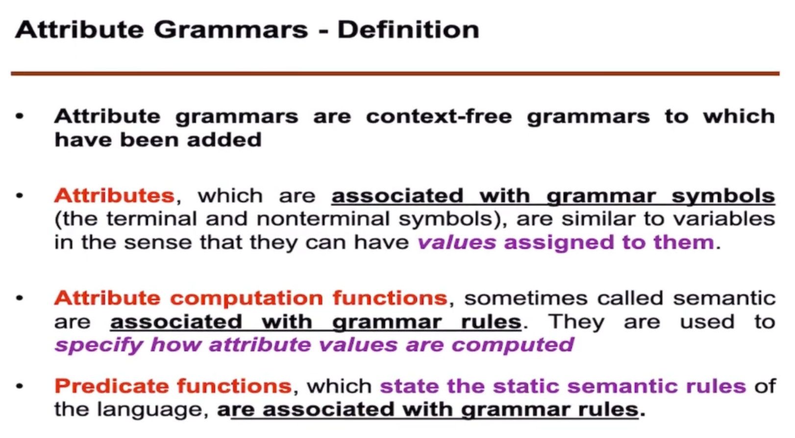
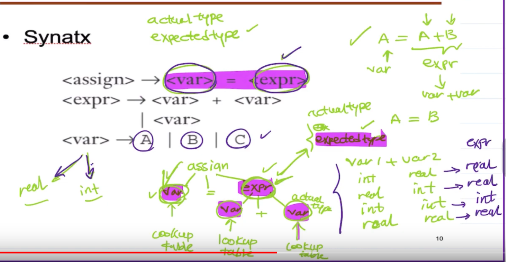
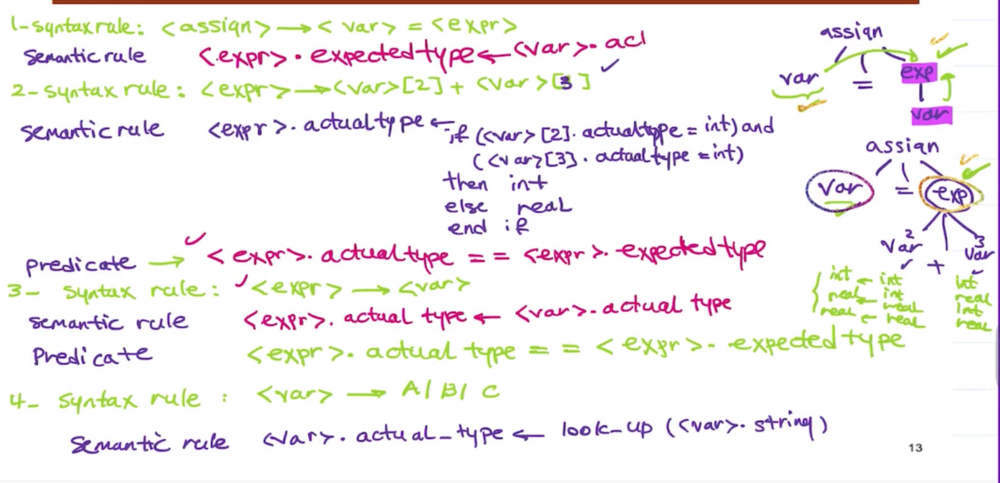
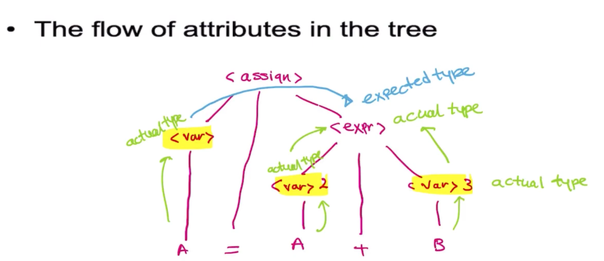
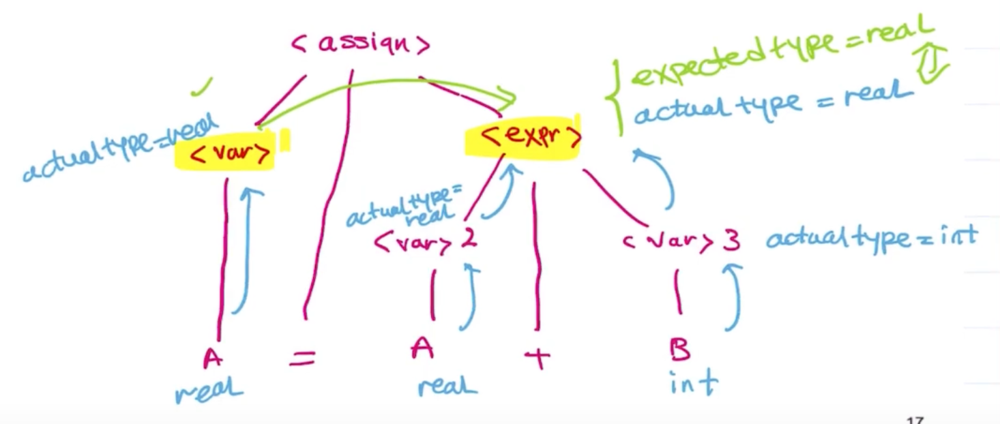

# Attribute Grammar
Device used to describe more of the structure of a programming language than can be described with a context-free grammar. 
 
 

 
The expected type of the expression depends on the actual type of the variable.  

## Example 
 
The expected type of the expression will depend on the two variables.  
Return value depends if they match or not, in this case if they are both `ints` it returns and `int`.   

## Flow attributes in a tree
 
 
The expected type on the left is real, and the actual type, derived from the look up table on the right, is real, so there is **type compatibility** 

