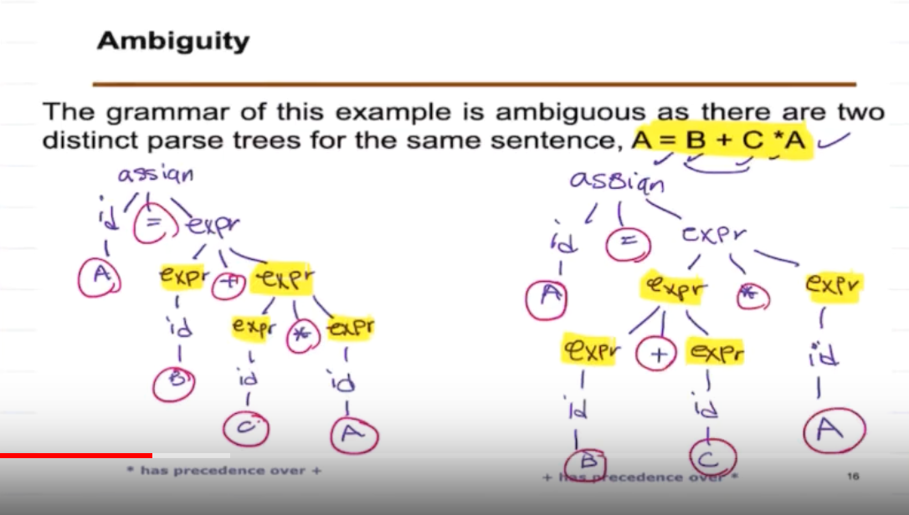
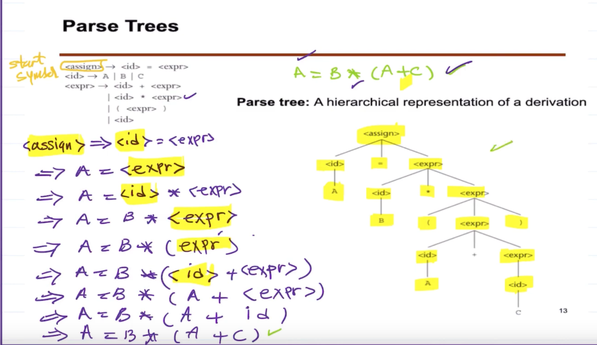
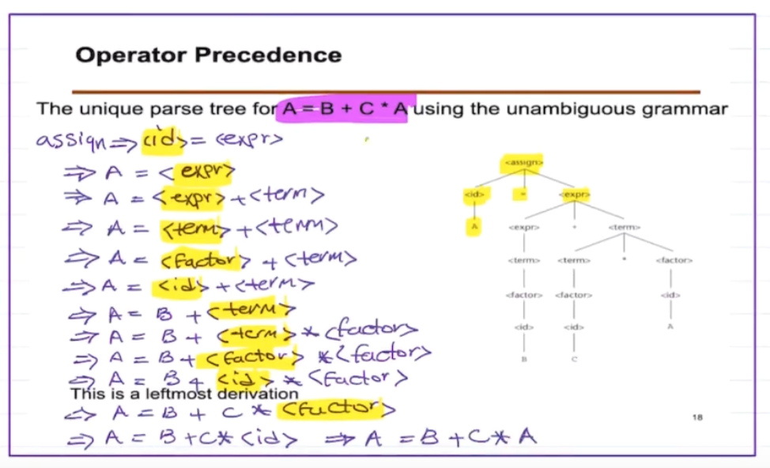
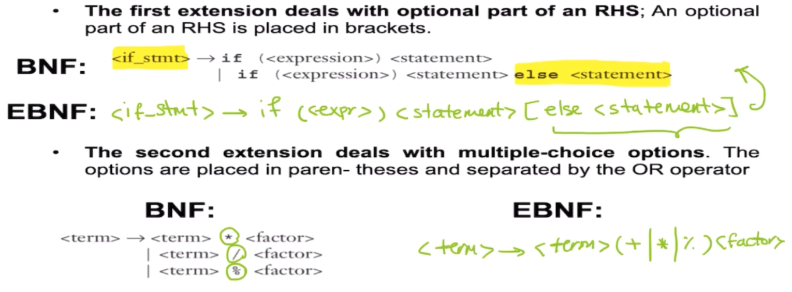
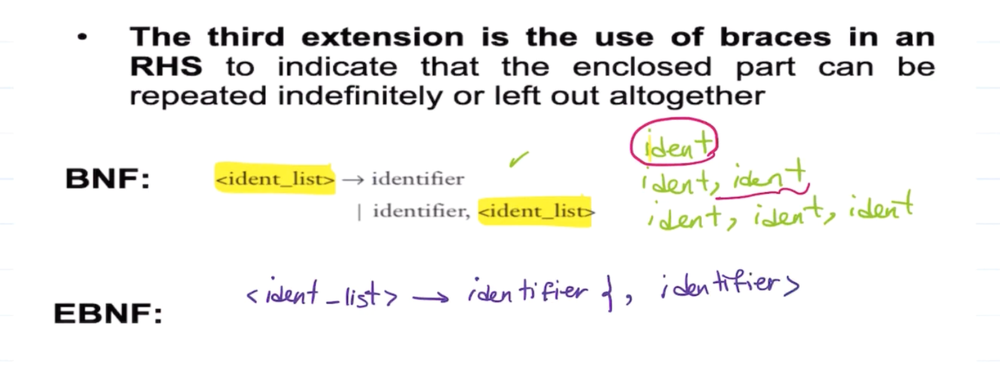

# BNF
- A metalanguage  
- natural notation for describing syntax
- uses abstractions for syntactic structures

## An example 
A simple Java assignment statement, for example, might be represented by the abstraction `<assign>`  
`<assign> → <var> = <expression> `  
LHS is the abstraction being defined and the RHS is the definition of the LHS.  

## Ambiguity 
A grammar that generates a form for which there are two or more distinct parse trees is said to be ambiguous.
 

## Parse Trees
hierarchical syntactic structure of the sentences
Notice that the lower you go in the tree, the higher precedence it has.  

## Operator Precedence 
Solve the left side, then the right.  
 

## Extended BNF
 
 

