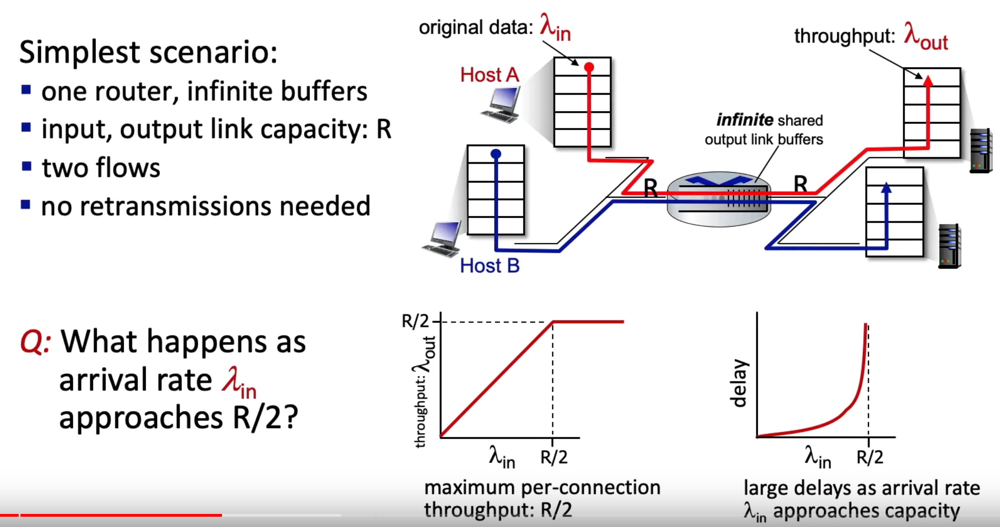
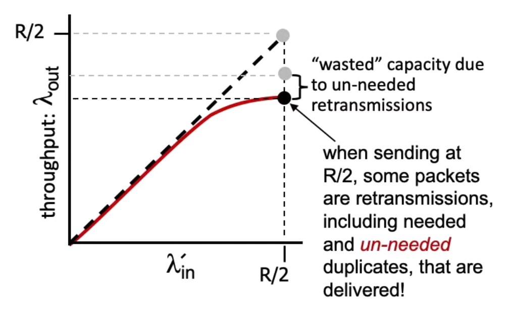
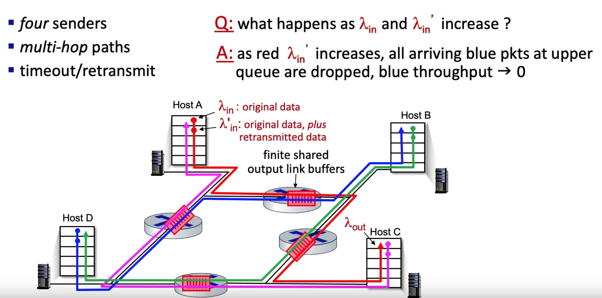

# Congestion Control
[video lecture](https://www.youtube.com/watch?v=Fm92xvIp6JY)  
[lecture 2](https://www.youtube.com/watch?v=cIHiSR4j3g4)  
Too many sources sending too much data too fast for a network to handle.  

 
 
 

## Congestion Collapse
As the senders increase their rate, the throughput actually goes down, because of all the congestion.  
Because you are sending retransmission, and if it never gets there, throughput approaches 0.  

