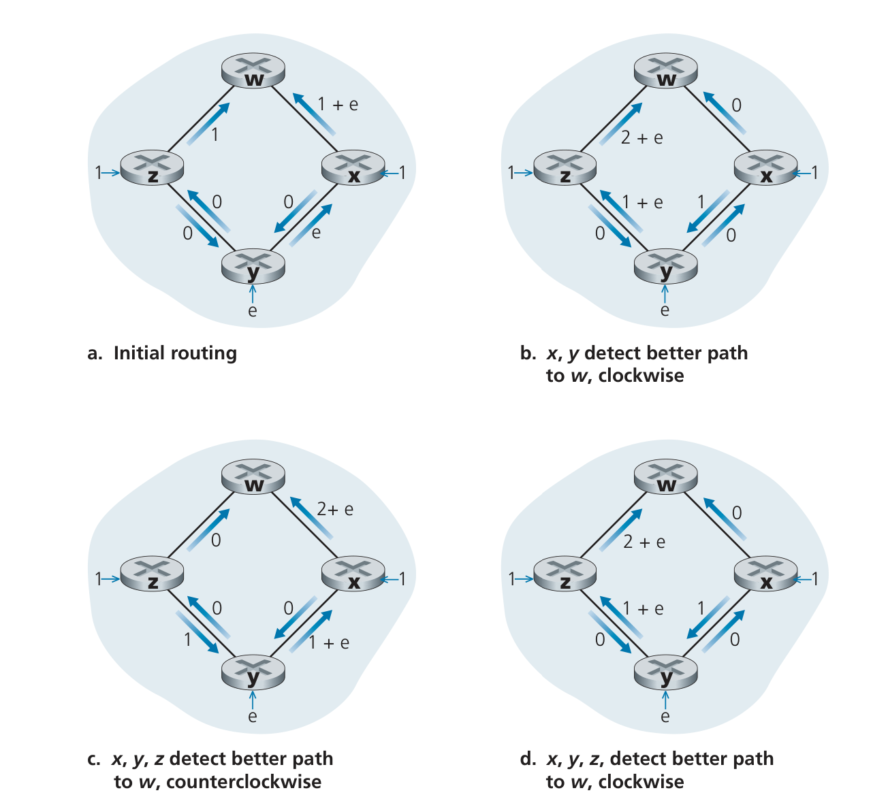
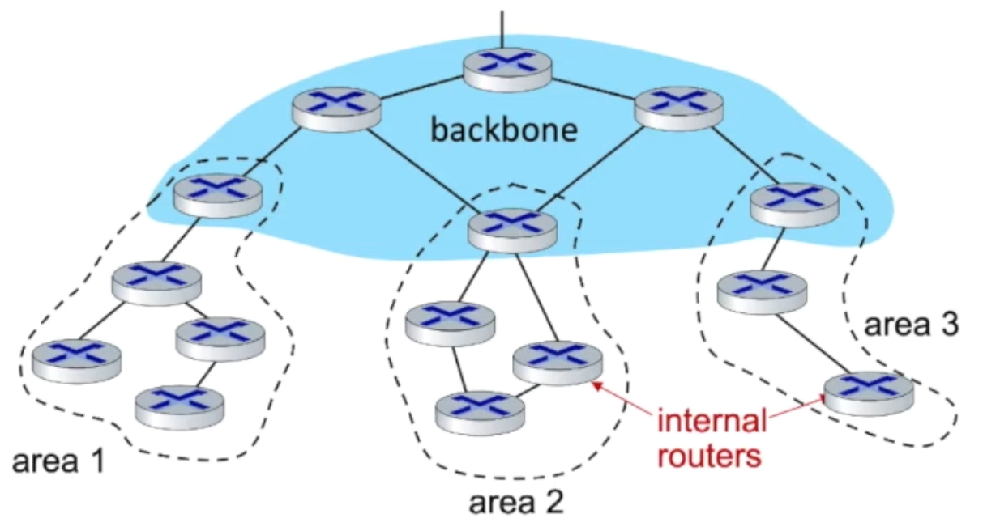
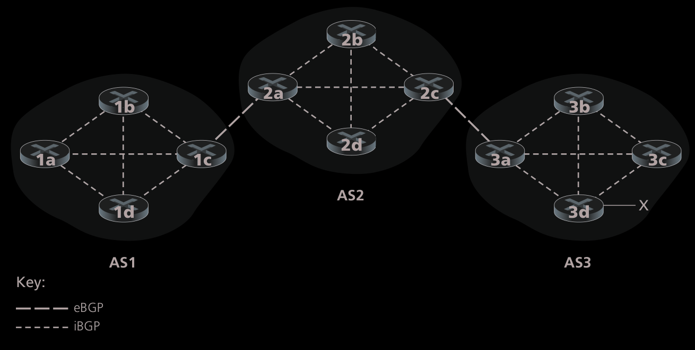
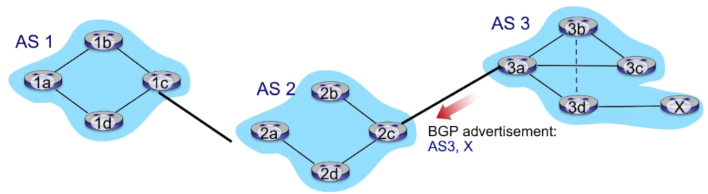
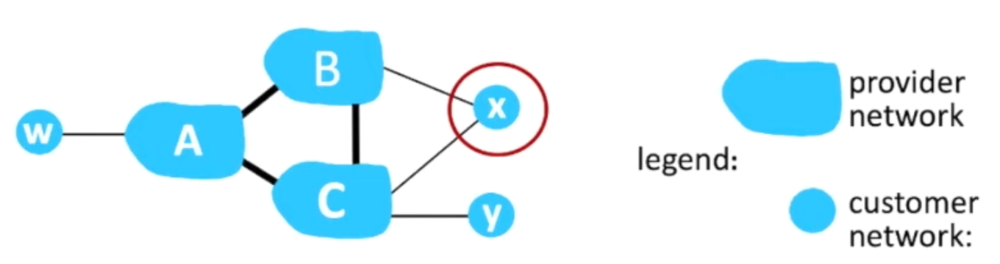

# Control Plane
Network-wide logic that controls not only how a datagram is routed along an end-to-end path from the source  host to the destination host, but also how network-layer components and services are  configured and managed

## Routing Protocols 

### Link State 
- network topology and all link costs are known
- Use [Dijkstra's Algorithm](notes/Dijkstra%27s%20Algorithm.md) in order to get shortest path 

#### Oscillations with congestion 
 
> Every time the algorithm is run, there are going to be updates that might cause oscillation

### Distance Vector
[video](https://youtu.be/jJU2AVX6gpU?si=vxLlNgW6d6Pq7M_k ) 
- iterative, asynchronous, and distributed
- each node receives some information from one or more of its directly attached  neighbors, performs a calculation, and then distributes the results of its calculation  back to its neighbors

#### Bellman-Ford Equation
> Good News Travels Fast, Bad News Travels Slow

The main idea here is **Information Propagation** 

$$
d_x(y) = \text{min}_v\{c(x,y) + d_v(y)\}
$$

## Intra-AS Routing in the Internet
> intra-autonomous system routing protocol

[video](https://youtu.be/iUQmn3nNjaI) 

Terminology
- Intra: Inside the network 
- AS: Autonomous systems 

Problem with routers: 
- Scale: As the number of routers becomes large, the overhead involved in communicating, computing, and storing routing information becomes prohibitive.
- Administrative autonomy: Internet is a network of ISPs, with each ISP consisting of its own network of routers. An ISP generally desires to operate its network as it pleases.  

These problems can be solved by organizing routers into autonomous systems, with each AS consisting of a group of routers that are under the same administrative control

> There are 3 routing protocols that are used to solve this problem, RIP(taken over by OSPF), OSPF, EIGRP(Was closed source, open source in 2013)

### OSPF 
> Open Shortest Path First

- link-state protocol that uses flooding of link-state information and a [Dijkstra's least-cost path Algorithm](notes/Dijkstra%27s%20Algorithm.md)  
- each router constructs a complete topological map of the entire autonomous system.
- Each router then locally runs Dijkstra’s shortest-path algorithm to determine a  shortest-path tree to all subnets, with itself as the root node.
- All OSPF messages are authenticated.  

#### Hierarchical mode 
 
Has 2 sections, the local area and the backbone.  
Advertise only to the local area, or to the backbone.  

## Routing Among IPS
> Conditional Information propagation 
> Policy > Performance 

[video](https://youtu.be/2rV4tJkP-CQ) 

### BGP
> Uses advertising in order to connect to other parts of the internet. 

Terminology: 
- eBGP: destination network reachability information 
- iBGP: propagate information reachability to routers within its **own** network

 
Notice that **2a** and **3a** are able to run both **eBGP** and **iBGP**.  

#### BGP Connections 
Establishes a temporary [TCP](notes/TCP.md) connection in order to advertise paths.  

 
**3a** promises that it will route traffic to **X** 
**2a** will propagate this information to **1c** and from there **AS 1** now has a connection to **X** 

#### Using Policy in order to generate MONEY 

 
It is in the best interest of the ISP to send traffic to its paying customers, packets with in the network that are not to paying customers is known as *transitory* traffic.   
In the image, the 3 different ISP's, will not advertise to each other because then they will start having transitory traffic. 

**x** can route traffic between **B** and **C**, but it shouldn't have to, so it will not advertise to either **B** or **C** that it can do so. In this way, we can prevent a connection.  

#### Hot Potato Routing

