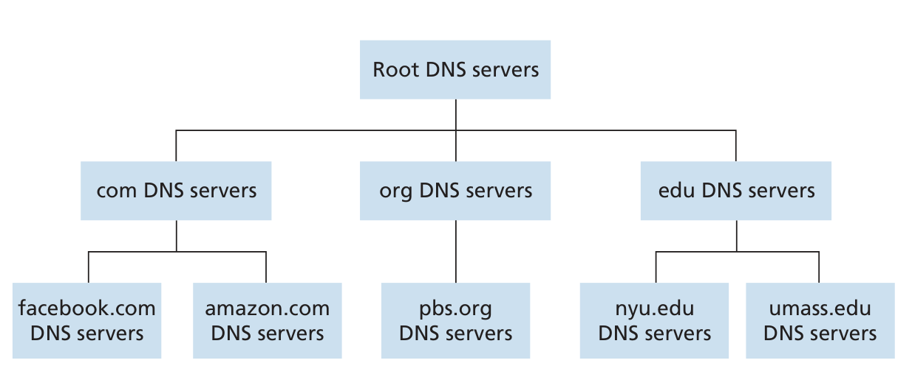
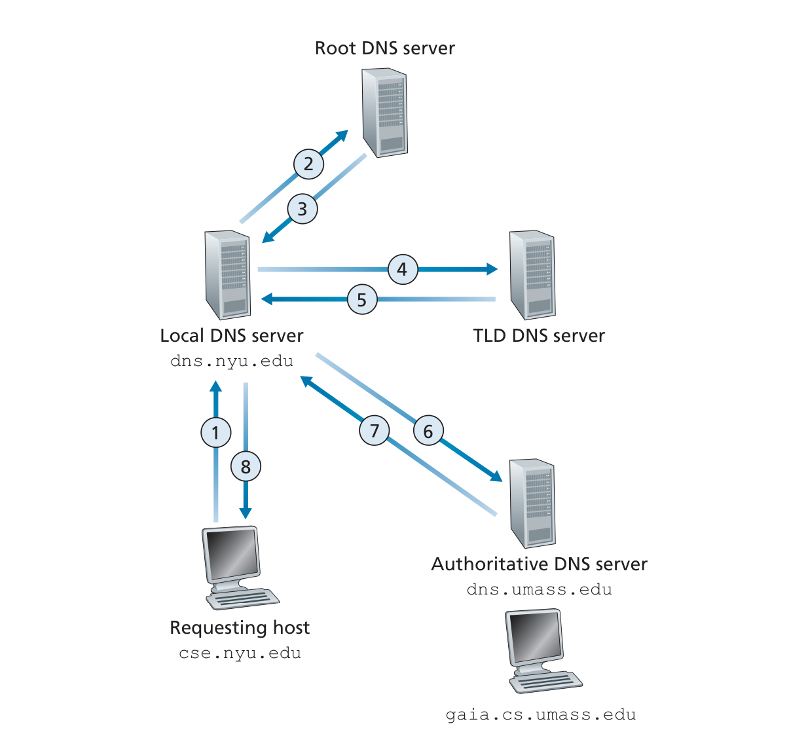

# DNS
The DNS is (1) a distributed database implemented in a hierarchy of DNS servers, and (2) an application-layer protocol that allows hosts to query the distributed database
host name: mnemonic versions: www.facebook.com
computers use IP Addresses instead

If a server has too much traffic, you can increase the amount of servers you have to handle the load, and at the same time have a alias to the servers, so there is a distribution of load.  

## Why not have it as one centralized server? 
- A single point of failure.
- Traffic volume. 
- Distant centralized database. 
- Maintenance. 

## A Distributed, Hierarchical Database  
 

## Local DNS Server
Each ISP—such as a residential ISP or an institutional ISP—has a local DNS server (also called a default name server).  
When a host connects to an ISP, the ISP provides the host with the IP addresses of one or more of its local DNS servers  
When a host makes a DNS query, the query is sent to the local DNS server, which acts a proxy, forwarding the query into the DNS server hierarchy,

## Iterative DNS Request 
 

## DNS caching 
In a  query chain, when a DNS server receives a DNS reply (containing, for example, a  mapping from a hostname to an IP address), it can cache the mapping in its local  memory.
Because of caching, the local DNS server will be able  to immediately return the IP address.  
Often caches the TLD DNS server, so very few queries are actually called to the root.  

## DNS Messages

