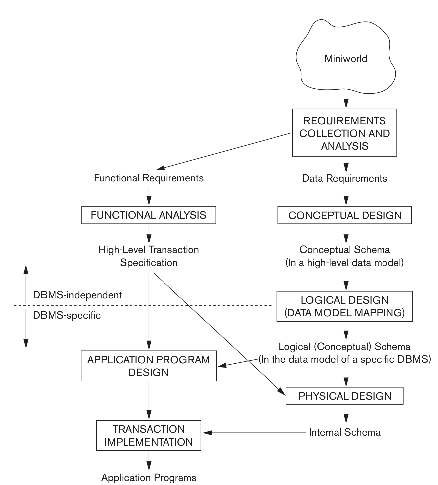

# Database Design
 

I like to think about this step from a top-down approach.  
This is separated into 2 parts, one for the database, on the right and the application on the left.  

Uses [Entity-Relationship Model](./ER%20Model.md)

## Application 
What does it need to work, and what functions does it require in order for it to work?  

