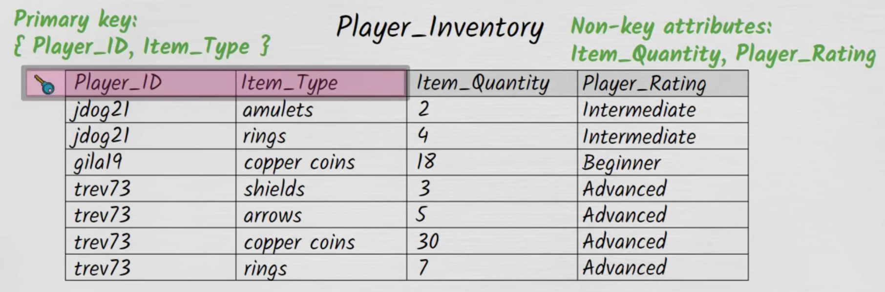

# Database Normalization
[Quick Video](https://www.youtube.com/watch?v=GFQaEYEc8_8)

> If your [DBMS](notes/DBMS.md) is not set up properly, you will get [Anomalies in Relational Model](notes/Anomalies%20in%20Relational%20Model.md), to fix this, use [Functional Dependency](notes/Functional%20Dependency%20in%20DBMS.md).  

> There are several types of "forms" that you can take to make it "better", and if you are in $n$, then you must already be in $n-1$ form.  

## First Normal Form (1NF)
[Jenny Lecture](https://youtu.be/g2yF2gyaN7I?si=gRsEyozg2kAaiWOD)  
- There should only be atomic values in each column  
- The values in the column should be of the same type.

### Solution 
If you want to convert the database into 1NF, there are 2 main ways. 
- Make a new table and use the foreign keys.
- Make a new table 

---

## Second Normal Form (2NF)
- Every non-prime attribute is fully dependent on a candidate key. 
- Do **NOT** have any partial functional dependency.

> This is a violation of second normal form.

---

## Third Normal Form (3NF)
- Eliminate transitive dependencies.
- Guidelines:
  - A relation must already be in 2NF.
  - Every non-key attribute must depend only on the primary key, the whole key, and nothing but the key.

> An example of a violation of third normal form.

---

## Fourth Normal Form (4NF)
- Eliminate multi-valued dependencies.
- Guidelines:
  - A relation must already be in 3NF.
  - No attribute should have more than one independent multi-valued dependency on the key.

> Multi-valued dependencies can lead to redundancy and potential anomalies in a table.

---

## Mnemonic for Normal Forms (1NF to 4NF)

**"All Cats Try Meowing"**

- **A**: **Atomicity** for 1NF (ensuring atomic values).
- **C**: **Composite keys** for 2NF (removing partial dependencies).
- **T**: **Transitive dependencies** for 3NF (removing transitive dependencies).
- **M**: **Multi-valued dependencies** for 4NF (removing multi-valued dependencies).

