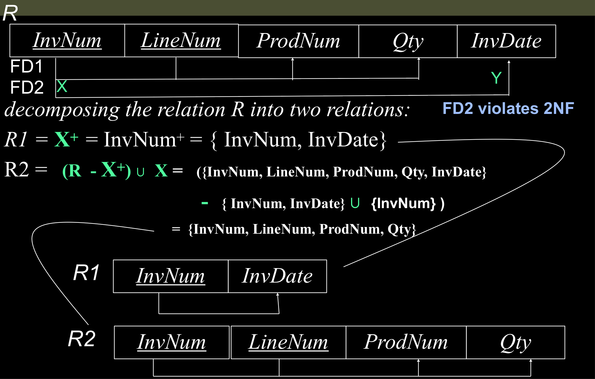

# Database Normalization
[Quick Video](https://www.youtube.com/watch?v=GFQaEYEc8_8)

> If your [DBMS](notes/DBMS.md) is not set up properly, you will get [Anomalies in Relational Model](notes/Anomalies%20in%20Relational%20Model.md), to fix this, use [Functional Dependency](notes/Functional%20Dependency%20in%20DBMS.md).  

> There are several types of "forms" that you can take to make it "better", and if you are in $n$, then you must already be in $n-1$ form.  

## First Normal Form (1NF)
[Jenny Lecture](https://youtu.be/g2yF2gyaN7I?si=gRsEyozg2kAaiWOD)  
- There should only be atomic values in each column  
- The values in the column should be of the same type.

### Solution 
If you want to convert the database into 1NF, there are 2 main ways. 
- Make a new table and use the foreign keys.
- Make a new table 

## Second Normal Form (2NF)
[Jenny Lecture](https://youtu.be/O16btnzfuYU?si=8aYsdYH84VmsgEWQ) 
- Do **NOT** have any partial functional dependency.  
- You can **NOT** have this: $\text{Anything from the CK} \to \text{non prime attribute}$

### Solution 
Decompose the relation $R$ into 2 relations:  
The relation being violated: $R_1$: $X^{+}$  
The new relation: $R_2 = (R - X^{+}) \cup X$  
| Image | Description |
| -------------- | --------------- |
|  | `InvDate` here is dependant on the key, `InvNum`, so this violates **2NF** |

## Third Normal Form (3NF)
- Eliminate transitive dependencies.
As an example, if you have: 
- $X$ as a key (prime attribute)
- $Y,Z$ as non prime attributes
then $X \to Y, Y \to Z$ is a violation of **3NF** 

