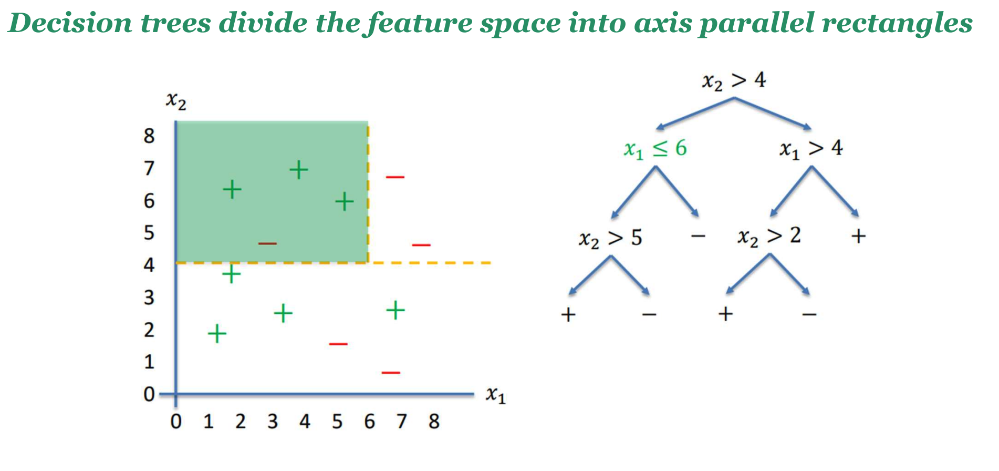

# Decision Trees
A greedy algorithm. 
Use parameters to separate and classify data.  
The training part might take a while, but because the end result is a bunch of if statements, the execution is very fast.  

## Dividing the Feature Space
Left is yes, right is no.  

## Entropy 
Like your loss function from [Logistic-Regression](./Logistic-Regression.md).  
High entropy means they are mixed, low means they are separated.  
When entropy decreases because you made the right choice of parameters, it is called Information Gain.  
Choose the root by the parameter that gives you the most information gain.  
$$
H(Y) = - \sum_{Y=y} p(Y = y) \log p(Y = y)
$$

### Distribution based on type
 

## Missing Attributes
Many times, an attribute will be missing.  
You should not remove it from the tree, as it may lead to a bias.  
To use the tree, start at where the attribute is missing.  

## Over fitting 
By pure chance, you could have very specific attributes that can classify elements very well.  
Because of the recursion, when you go down the tree you have less data, so you are working with less data.  This can lead to over fitting. 

### Train / Test Split 
Not a solution to avoid over fitting, just a way to identify if it happens.  

### Pre-Pruning or Early Stopping 
Stop the recursion before it generates a new tree  
Here are some criteria: 
- Minimum number of samples in parent 
- Mac depth of tree
- Minimum Information Gain 

### Post-pruning 
Grow the tree, then start cutting, bottom up.  

> Apart from entropy, other measures can be used to combined with IG to select the best attribute

? The training of data takes a long time, but the actual execution is fast, because you can just do if else statements.  
