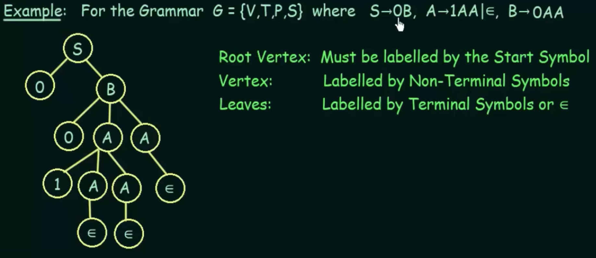
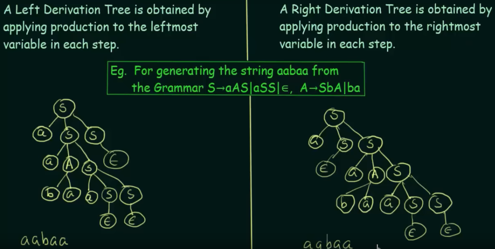

# Derivation Tree
ordered, rooted tree that graphically represents the semantic structure of a string according to some context-free grammar.  
[video](https://www.youtube.com/watch?v=u4-rpIlV9NI)  
 

## Left and Right Derivation 
 

