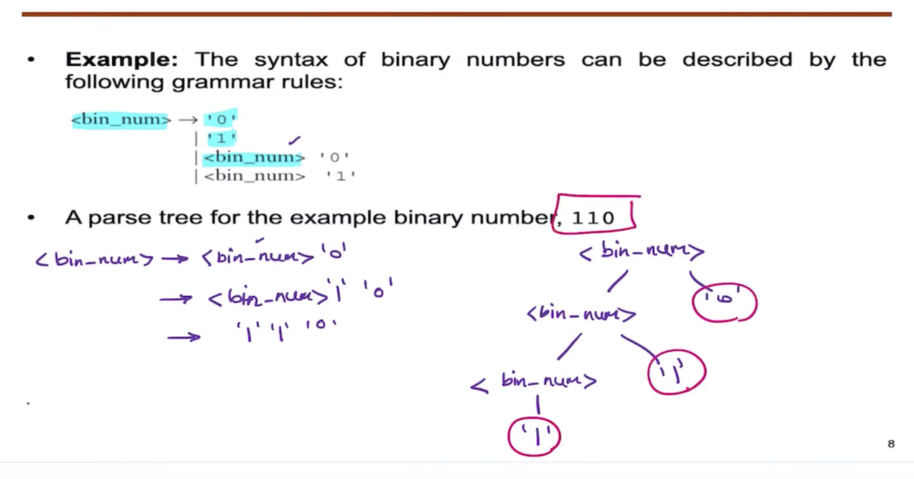
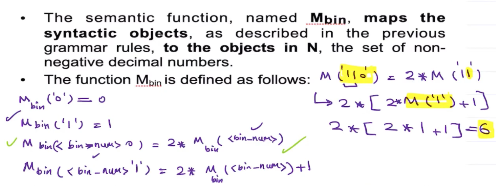
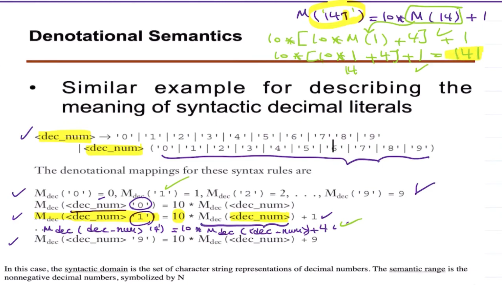
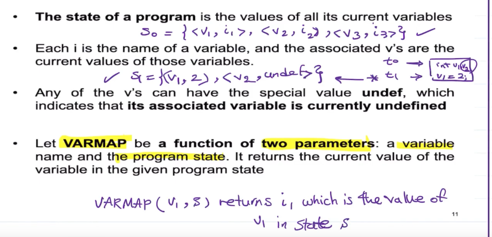

# Dynamic Semantics

## Operational Semantics

- **Operational semantics** is to describe the meaning of a statement or program by specifying the effects of running it on a machine.

- The effects on the machine are viewed as **the sequence of changes in its state**, where the machine's state is the collection of the values in its storage.

- An obvious operational semantics description, then, is given by executing a compiled version of the program on a computer, but **machine language is too low level to be understood**; so we need an **intermediate-level language**.

 
Mapping string to decimal.  
 

## Program State
 

