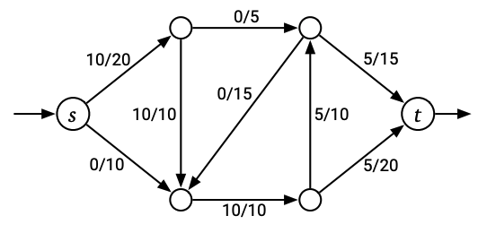

# Flow Network
I like to think of this as a directed [Graph](notes/Graph.md) with constraints on the *flow*.   
$s$: Source node  
$t$: Sink node  

| Image | Description |
| -------------- | --------------- |
|  | The flow entering $s$ must be the same as the flow exiting from $t$. The bottom part of each fraction is the **maximum** capacity. The top part is the actual flow leaving the vertex. Notice that every vertex follows this **convervation contraint**.   |

