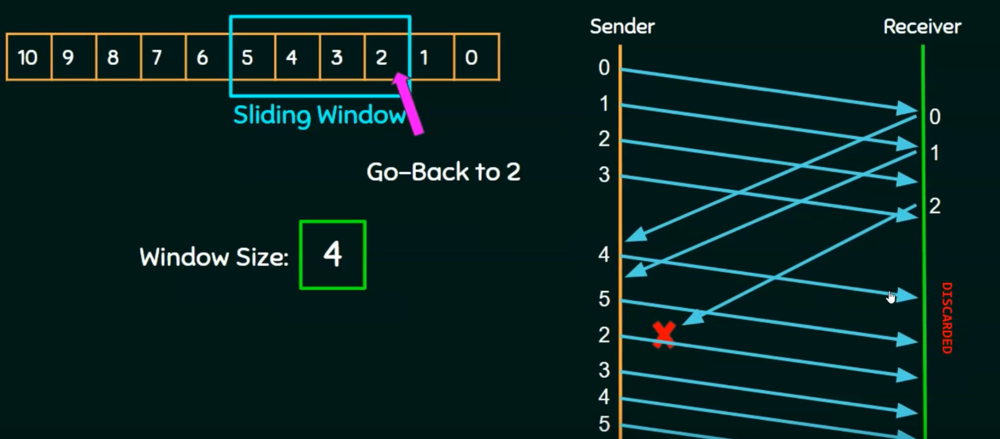
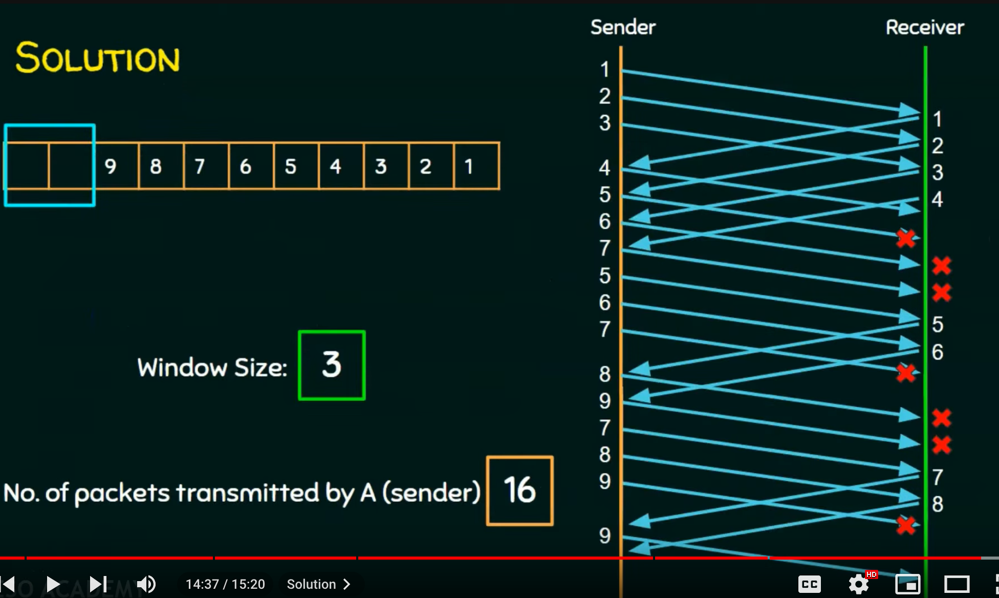
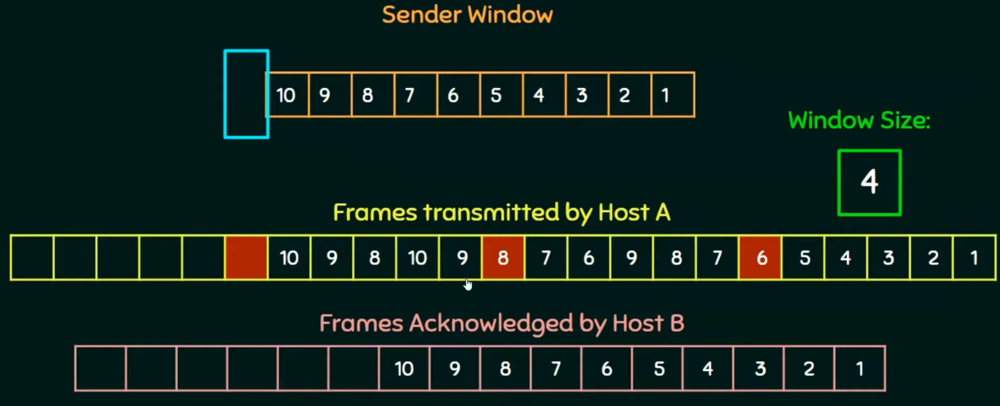

# Go-Back-N
[Neso Video](https://www.youtube.com/watch?v=QD3oCelHJ20)  
- When the sender receives and ACK for the packet, slide window up by one.  
- if lose one, send up to N in the current window  
- Must use at least n + 1 unique sequence numbers, to avoid edgecase where receiver gets duplicate
#### Example 
 
Notice that ACK 2 is lost, so the sender sends out **ALL** the packets in the window, from 2 ... 5

#### Example Problem 1
[Video Solution](https://youtu.be/cqPWjo2iLgk?si=nD25Jjja_VMpvt4w)  
> Station A needs to send a message consisting of 9 packets to station B using a sliding window (window size 3) and go-back-n error control strategy. All packets are ready and immediately available for transmission. If every 5th packet that A transmits gets lost (but no ACKs from B ever get lost), then what is the number of packets that A will transmit for sending the message to B? [GATE CS 2006]

 

#### Example Problem 2
[Video Solution](https://youtu.be/PHcIuxvLSzc?si=rM-zly59ZrVc6ZPZ)  
> Host A wants to send 10 frames to Host B. The hosts agreed to go with Go-Back-4. How many number of frames are transmitted by Host A if every 6th frame that is transmitted by Host A is either corrupted or lost?

 
All the frames are sent one by one up to 9. `B` never gets an `ACK` for packet 6, at that point the window is `[6, 7, 8, 9]`, so we send all those packets again.   
Answer: 17

