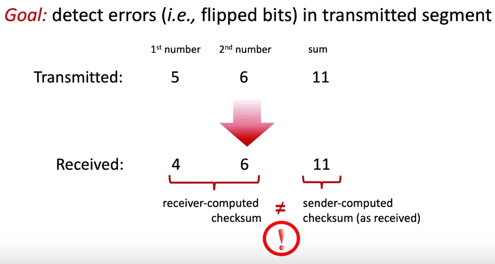

# Internet Checksum
 
Sum these k-bit integers and use the resulting sum as the error-detection bits  

Receiver checks the checksum by  taking the 1s complement of the sum of the received data (including the checksum)  and checking whether the result is all 0 bits. If any of the bits are 1, an error is indicated.
