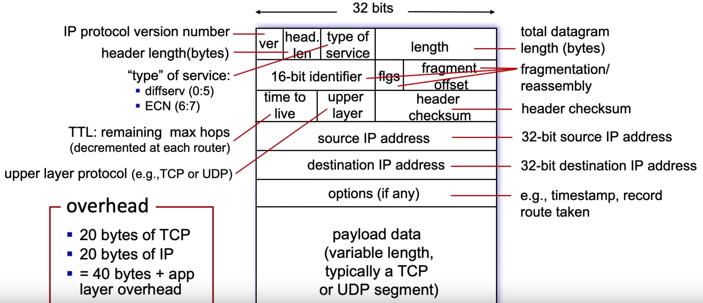
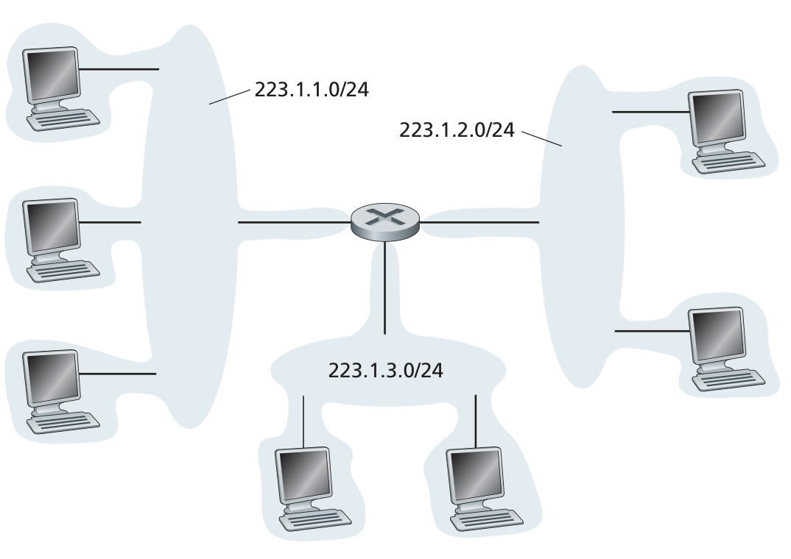
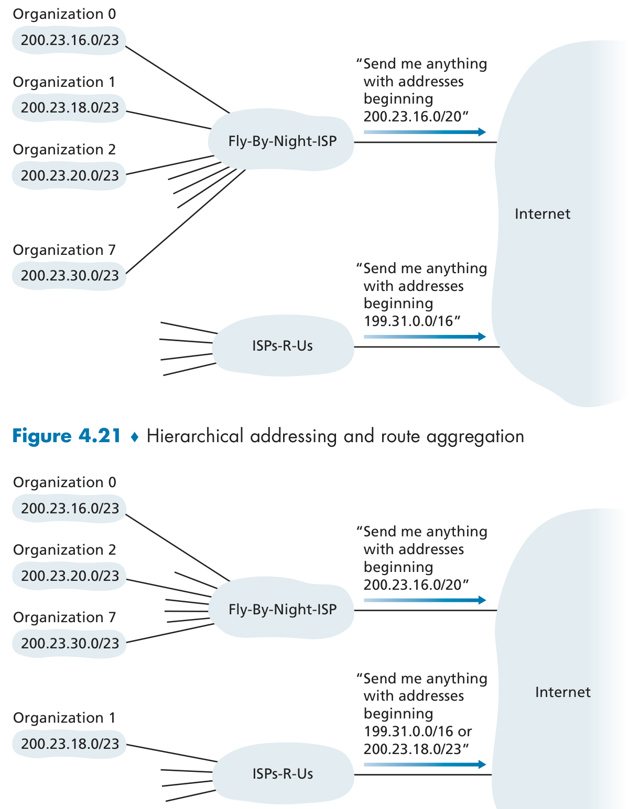
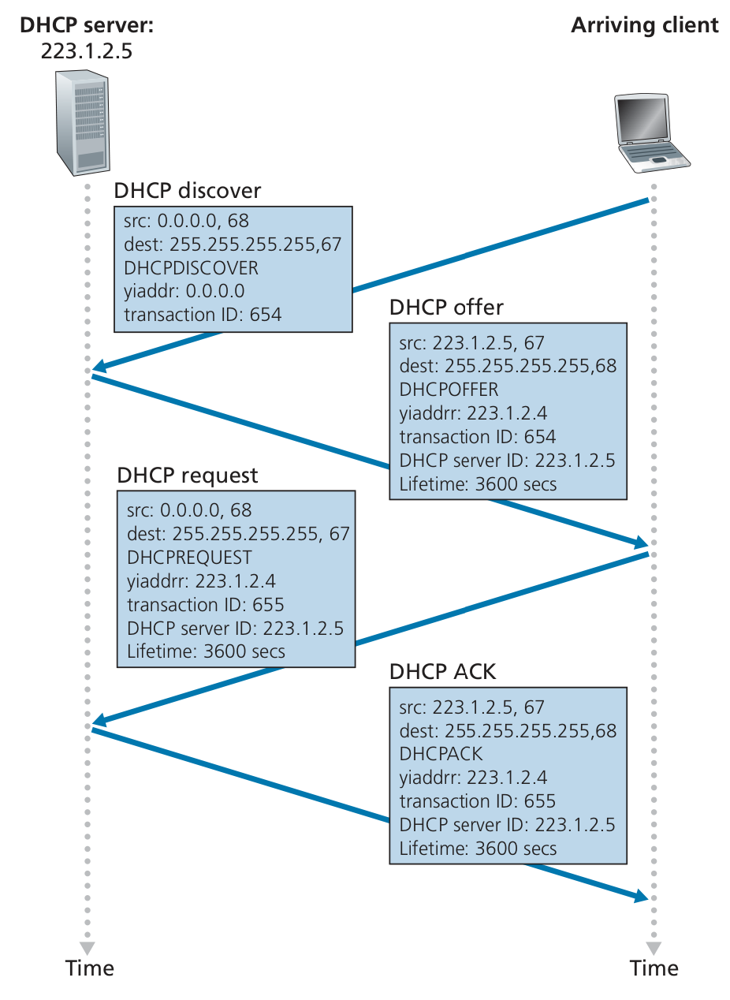
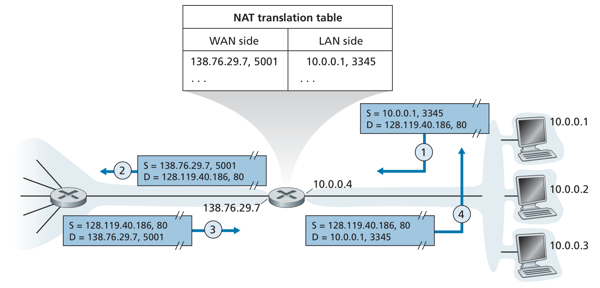
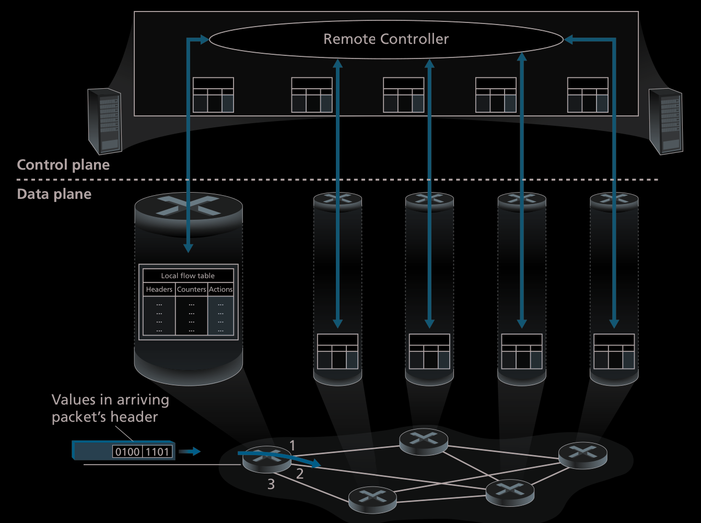
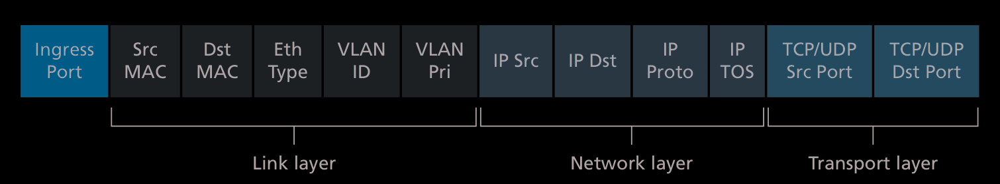

# Internet Protocol

## IPv4

### Datagram Format 
 

### Addressing 
The boundary between the host and the physical link is called  an interface.
- IP address is technically associated with an interface,  rather than with the host or router containing that interface. 

## Subnet 
[Article by Cloudfalre](https://www.cloudflare.com/learning/network-layer/what-is-a-subnet/) 
> It took my so long to realize that subnet just means subnetwork 

 
To determine the subnets, detach each interface from its host or router, creating islands of isolated networks, with interfaces terminating the end points of the isolated networks. Each of these isolated networks is a subnet

### Classless Inter Domain Routing 
> CIDR, pronounced Cider

- Subnet portion of address of arbitrary length
- Address format: a.b.c.d/x, where x is # bits in subnet portion of address

| Subnet Part            | Host Part       |
|------------------------|-----------------|
| 11001000 00010111 00010000 | 00000000      |

`200.23.16.0/23` 

## How to get an IP Address

### How an ISP gets a block of addresses
IP addresses are managed under the authority of the Internet Corporation for Assigned Names and Numbers (ICANN)
Assigned by ICANN.  

### How a organization gets assigned a range of IP addresses 
The ISP itself has a range of addresses, so then it divides it into 8 equal blocks of addresses and assigns that to the org. 
 
#### What if an org changes ISP's? 
 
Notice that the second ISP now signals for organization 1, range of addresses and this works out because it is more specific. I.E it uses the [Longest Prefix Matching](notes/Longest%20Prefix%20Matching.md) rule and then the [Routers](notes/Router.md) will use that in their lookup table to send that packet to that destination.  

### How a host gets an IP address
  
#### DHCP
> Dynamic Host Configuration Protocol 

| Image | Description |
| -------------- | --------------- |
|  | Uses the [Client Server Model](notes/Client%20Server%20Model.md) in order to assign IP address to a connecting host. |

## NAT
> Network Address Translation

 

## Generalized Forwarding and SDN 
 
> The open sourced API version of forwarding 

- significantly more general “match-plus-action” paradigm, where the “match” can be made  over multiple header fields associated with different protocols at different layers in  the protocol stack.

### Match 
 
> Uses these in order to match 

### Action 
- Forward
- Dropping
- Modify
