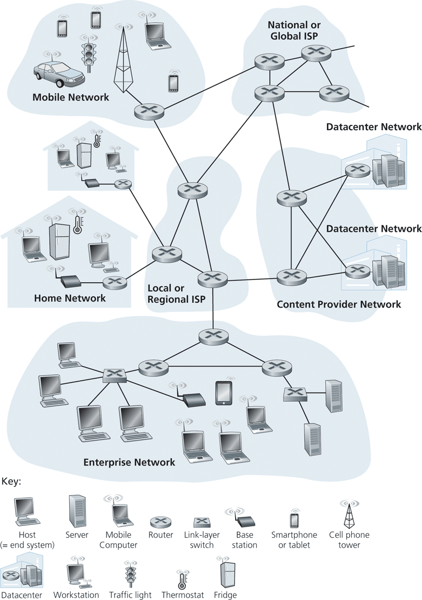

# Internet
The internet is a computer network that interconnects billions of computing devices throughout the world.  

| Image | Explanation|
| -------------- | --------------- |
|  | The important parts here are the end systems and the routers. |

