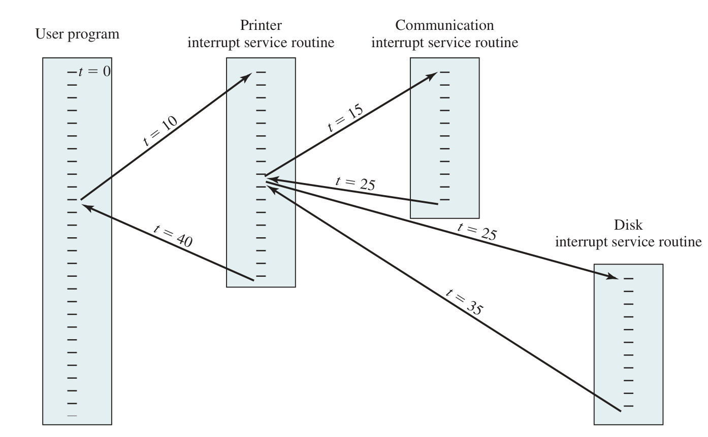

# Interrupts
An interrupt is a signal sent to the processor by hardware or software indicating an event that needs immediate attention. The processor responds to the interrupt by pausing its current tasks, saving its state, and executing an interrupt handler to deal with the event. After handling the interrupt, the processor resumes its previous tasks.  
An obvious use of this is when there is an error in the process by another module, memory, I/O, etc... 

## Processor Utilization 
The processor is much faster than I/O operations, we have to find some way to handle the request of the I/O and then come back to what we were doing.  
This is the whole purpose of an interrupt.  

# Multiple Interrupts 

## Disabled Interrupt  
Processor ignores any new interrupt request signal. If an interrupt occurs during this time, it generally remains pending and will be checked by the processor after the processor has re-enabled interrupts.

### Drawbacks 
Does not take into account relative priority or time-critical needs.  

## Priority Interrupt 
Interrupts are assigned priority values, and then they are handled.  
If a new interrupt happens while it is being handled, and it has a higher priority, current one is paused and the next one is started.  
 

