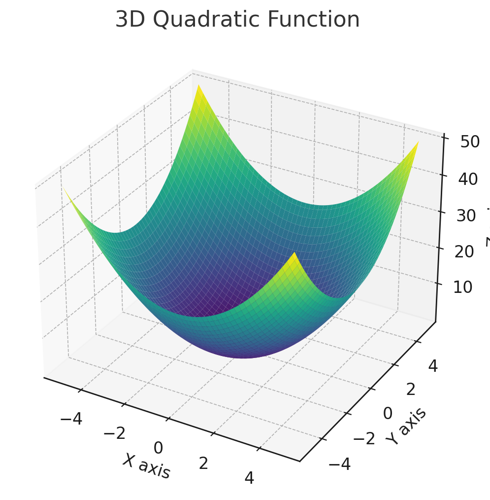
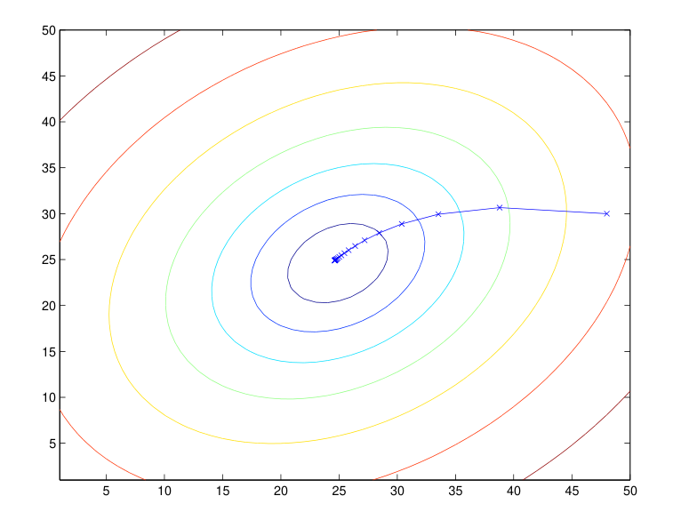
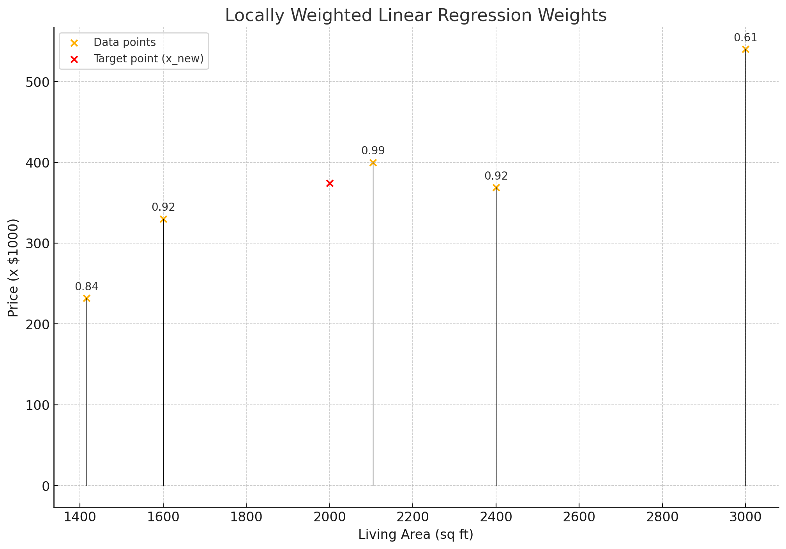

# House Example Data 
| Living Area $(x_1)$ | Bedrooms $(x_1)$| Price $(y)$|
|-----------------------|--------------------|---------------|
| 2104                  | 3                  | 400           |
| 1600                  | 3                  | 330           |
| 2400                  | 3                  | 369           |
| 1416                  | 2                  | 232           |
| 3000                  | 4                  | 540           |

$n$ = number of features, columns  
$m$ = number of training sets, rows 

## The Linear Model
Lets say that we want to find a way to get a model that best fits our housing data.  
We will call this linear model, the hypothesis function $h(x)$, and it will look something like this:
$$ h(x) = \theta_0 + \theta_1x_1+ \theta_2 x_2$$  
The $x_n$ is every feature that the data has.   
Play around with the parameters (weights) $\theta$ to be able to minimize the error in the model.  

So how do we make this model accurate?  
One way to do it is by looking at the errors between our model and the real $y$ value and trying to minimize that.  

## Optimizing Errors 
Define a new function $J(\theta)$ that will be used to tell us the value of our errors.  
Use [Ordinary Least Squares](./OrdinaryLeastSquares.md) to define our new cost function: $J(\theta)$ and try to optimize that. 
$$
J(\theta) = \frac{1}{2} \sum_{i=1}^m (h_\theta(x^{(i)}) - y^{(i)})^2
$$
The function can be read as:   
take all the inputs $x$ in that row and insert them into the hypothesis function, then take the real values $y$ and get the differences.   
We square the values to ensure they are positive and to give a higher value to bigger errors. 
Then we get the sum of all the rows, and we divide by 2, for mathematical convenience. 

Now that we have a way of measuring the value of our errors, how can we minimize them?  

## Minimizing our errors
### 1. The Iterative Approach 
Lets start off with a straight line along the x-axis.  
As you can imagine the error values are just the $y$ values of our data.  
Let's put our line closer towards where the points are. Leading to a reduction of our errors.  
Now what if we keep doing this? Keep trying to fit it, moving it little by little every time depending on our cost?  
And we can optimize this, using the derivative of our cost function as a lead.  
This is [Gradient Descent](./GradientDescent.md), which starts with a random $\theta$ and performs an update every time. 
$$ \theta_j := \theta_j - \alpha \frac{\partial}{\partial \theta_j} J(\theta) $$
$\alpha$ here is the learning rate, defined by us, telling the iteration how big of a step to take.  

Deriving the Partial Derivative

Let's take one row of the training data to make our calculations easier. 
$$
\begin{aligned}
  &\text{Cost function:} \\
  &J(\theta) = \frac{1}{2} (h_\theta(x) - y)^2 \\
  &\text{Compute the partial derivative of } J(\theta) \text{ with respect to } \theta_j \text{ and apply the chain rule} \\
  &\frac{\partial}{\partial \theta_j} J(\theta) = \frac{\partial}{\partial \theta_j} \left( \frac{1}{2} (h_\theta(x) - y)^2 \right) \\
  &= 2 \cdot \frac{1}{2} (h_\theta(x) - y) \cdot \frac{\partial}{\partial \theta_j} (h_\theta(x) - y) \\
  &= (h_\theta(x) - y) \cdot \frac{\partial}{\partial \theta_j} (h_\theta(x) - y) \\
  &\text{Recognize that } h_\theta(x) = \sum_{i=0}^{n} \theta_i x_i: \\
  &= (h_\theta(x) - y) \cdot \frac{\partial}{\partial \theta_j} \left( \sum_{i=0}^{n} \theta_i x_i - y \right) \\
  &\text{Since } y \text{ is constant with respect to } \theta_j, \text{ the derivative of } y \text{ with respect to } \theta_j \text{ is 0:} \\
  &= (h_\theta(x) - y) \cdot \frac{\partial}{\partial \theta_j} \left( \sum_{i=0}^{n} \theta_i x_i \right) \\
  &\text{There is only one point in which we get } i = j \text{ so we get a single } \theta_j x_j \text{ so getting that derivative ...} \\
  &= (h_\theta(x) - y) \cdot x_j \\
\end{aligned}
$$

Now we have our update rule:
$$ 
  \theta_j := \theta_j + \alpha(y^{(i)}-h_\theta(x^{(i)}))x_j^{(i)}
$$
This rule is called the [Least Mean Squares](./LMS.md) update rule. 

Now that we found a way to optimize for one row, we need to incorporate all the rows.  
Repeat until convergence:  
$$
\theta_j := \theta_j + \alpha \sum_{i=1}^{m} (y^{(i)} - h_\theta(x^{(i)})) x_j^{(i)} \quad \text{(for every } j).
$$

This method of taking the input of every training example on every step and updating accordingly is called [Batch Gradient Descent](./BatchGradientDescent.md).   
> This is a very expensive algorithm to run, because as $m$ becomes large, you need to look at all the data in order to take a single step.  

The function will look like a quadratic function and the contours of the function represent the minimum as you converge.  
The lines on the contour are the steps you are taking.   
As you approach the minimum, fewer steps are being taken, because there is less of an error.  

| Quadratic Function                                       | Contours                                                  |
| -------------------------------------------------------- | --------------------------------------------------------- |
|  |  |

Another way to do this is by using [Stochastic Gradient Descent](./StochasticGradientDescent.md).
`for i = 1 to m`:
$$
\theta_j := \theta_j + \alpha  (y^{(i)} - h_\theta(x^{(i)})) x_j^{(i)} \quad \text{(for every } j).
$$

The algorithm starts immediately, updating for every row in the training data. 
> While this may be faster than the batch version, it is not absolute. It may oscillate around the minimum and may never find it.  

### 2. Pure Algebra
Is there a way to optimize $J(\theta)$ without using an iterative approach?  
Yes, and the math is cute and funny too.  
You will need to take a look at [Matrix Derivatives](./MatrixDerivatives) and [Matrix Trace](./MatrixTrace) in order for the notation to make sense.  

> One final piece of notation. 僕は絶対に約束する   
> Drop the intercept $\theta_0$ to simply get:
$$
h(x) = \sum_{i=0}^{n} \theta_i x_i = \theta^T x
$$

Getting the matrix version of our cost function

#### Converting our equations into matrices
There are a couple of things we need to do in order for us to minimize $J(\theta)$

I will denote $X$ to be the matrix form of our training set.  
$$
X = \begin{bmatrix}
-- & (x^{(1)})^T & -- \\
-- & (x^{(2)})^T & -- \\
& \vdots & \\
-- & (x^{(m)})^T & --
\end{bmatrix}
$$
> Multiply $X$ by the feature vector $\theta$ in order to get $X\theta$

 
And $\vec{y}$ will be the vector representing the target values.  
This is of length $m$ because that is how many rows we have. 

$$
\vec{y} = \begin{bmatrix}
y^{(1)} \\
y^{(2)} \\
\vdots \\
y^{(m)}
\end{bmatrix}
$$

**Subtracting the Target Values**:
To get the errors, we subtract $\vec{y}$ from the predicted values $X\theta$

$$
X\theta - \vec{y} = \begin{bmatrix}
(x^{(1)})^T \theta \\
(x^{(2)})^T \theta \\
\vdots \\
(x^{(m)})^T \theta
\end{bmatrix} - \begin{bmatrix}
y^{(1)} \\
y^{(2)} \\
\vdots \\
y^{(m)}
\end{bmatrix}
$$

**Resulting Error Vector**:
The resulting vector after subtraction represents the errors for each training example:
$$
J(\theta) = \begin{bmatrix}
h_\theta(x^{(1)}) - y^{(1)} \\
h_\theta(x^{(2)}) - y^{(2)} \\
\vdots \\
h_\theta(x^{(m)}) - y^{(m)}
\end{bmatrix}
$$

Deriving the Gradient of J

Finally, to minimize $J(\theta)$ let's find its derivatives with respect to $\theta$. 

Using the trace up our sleeve...
$$
\nabla_A \text{tr} (AB A^T C) = B^T A^T C^T + B A^T C
$$

Math time:

$$
\begin{aligned}
\nabla_\theta J(\theta) &= \nabla_\theta \frac{1}{2} (X \theta - \vec{y})^T (X \theta - \vec{y}) \\
&= \frac{1}{2} \nabla_\theta (\theta^T X^T X \theta - \theta^T X^T \vec{y} - \vec{y}^T X \theta + \vec{y}^T \vec{y}) \\
&= \frac{1}{2} \nabla_\theta \text{tr} (\theta^T X^T X \theta - \theta^T X^T \vec{y} - \vec{y}^T X \theta + \vec{y}^T \vec{y}) \\
&= \frac{1}{2} \nabla_\theta (\text{tr} (\theta^T X^T X \theta) - 2 \text{tr} (\vec{y}^T X \theta)) \\
&= \frac{1}{2} (\nabla_\theta (\theta^T X^T X \theta) + \nabla_\theta (\theta^T X^T X \theta) - 2 \nabla_\theta (\vec{y}^T X \theta)) \\
&= X^T X \theta - X^T \vec{y}
\end{aligned}
$$

$$
\nabla_\theta J(\theta) = X^T X \theta - X^T \vec{y}
$$

Set the derivatives of $J$ to $0$ (so we set the left side of the equation above to $0$).   
We now have the normal equation:

$$
(X^T X\theta) = X^T \vec{y}.
$$

Finally, we solve for $\theta$. Look at this beauty. 

$$
\theta = (X^T X)^{-1} X^T \vec{y}.
$$

> The computationally expensive part here is getting the inverse of $X^{T}X$

## Locally Weighted Linear Regression 
So far we have only seen ways in which we can get approximations based on the whole data set, but what if we just want to get approximations on a single point without having to worry about the whole data?   
In our housing example this would be comparable to trying to buy a house given the features $\theta$ and finding the price for that house, depending on all the other houses that are like that.   
We don't just want to consider the points around our target, but distance if a factor that we must consider.     
So we give **weights** to data points, depending on the distance from our target.   

$$
w^{(i)} = \text{exp}(-\frac{(x^{(i)}-x)^2}{2\tau^{2}})
$$

The parameter $\tau$ controls how sharply the weight of the data point falls off with distance. 

Now we can plug in $w^{(i)}$ to our data 

$$\sum_i w^{(i)} \left( y^{(i)} - \theta^T x^{(i)} \right)^2$$
And we do as before, try to minimize $\theta$ 

| Explanation                                                                             | Example                              |
| --------------------------------------------------------------------------------------- | ------------------------------------ |
| As you can see in our data that the points away from our $x$ have less and less weight. |  

