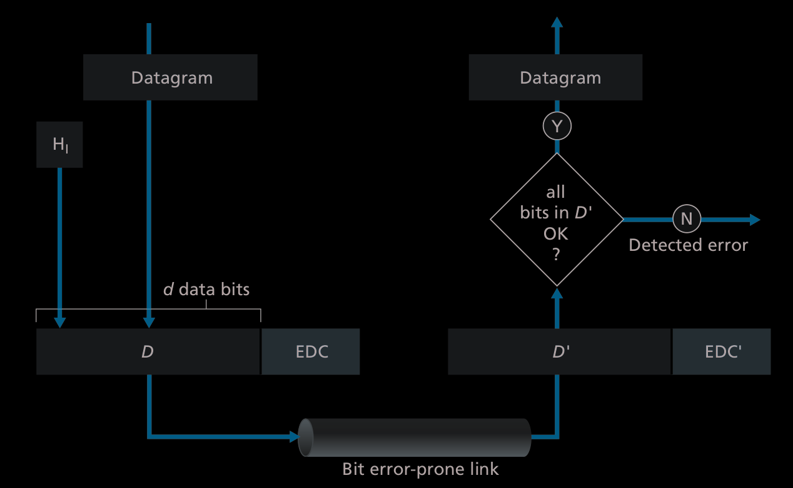
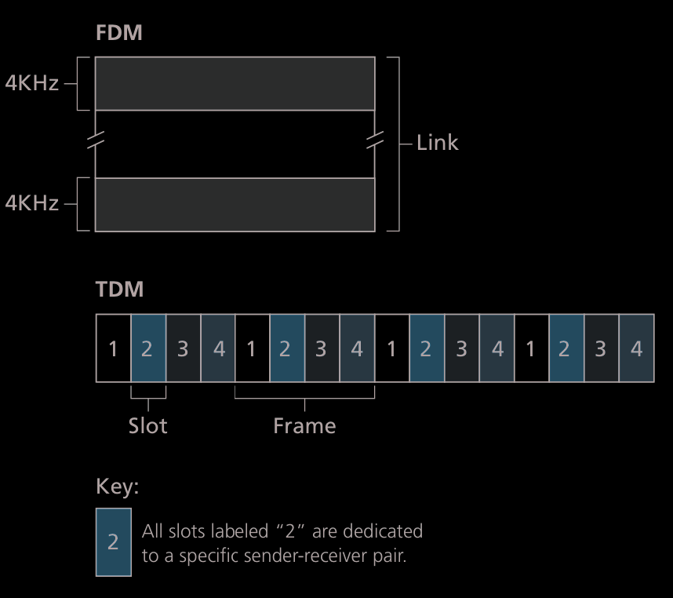
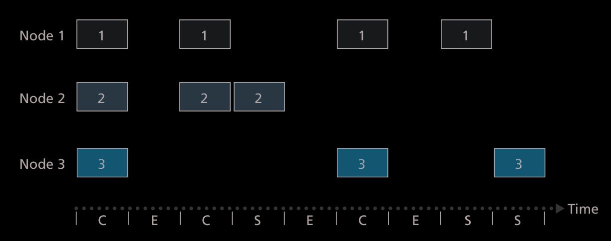
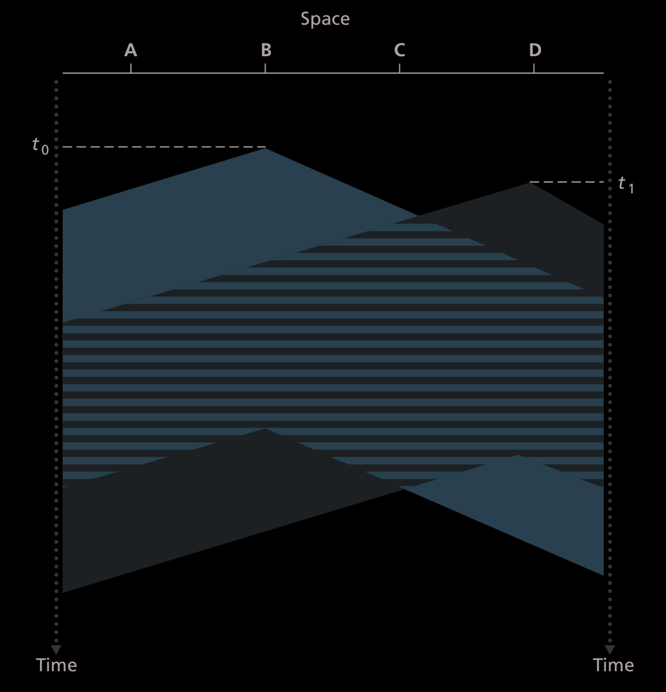
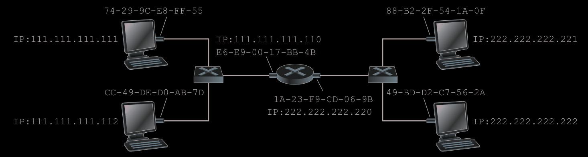
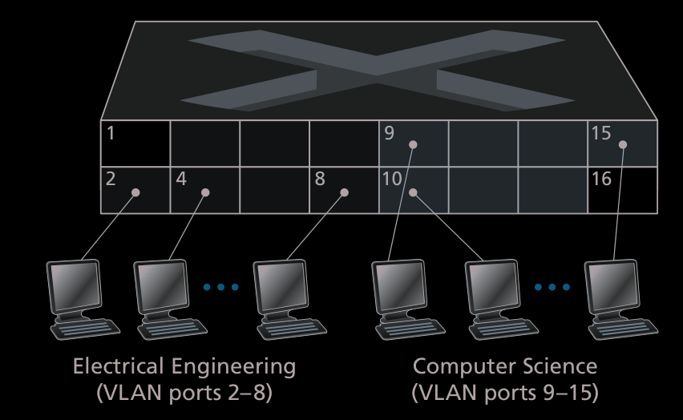
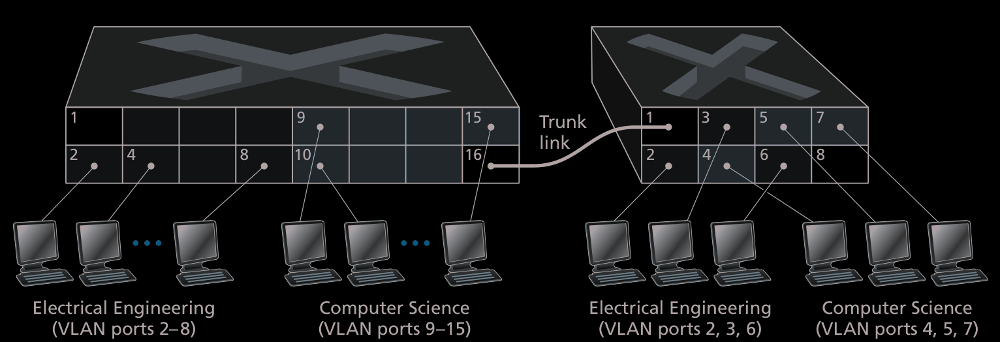
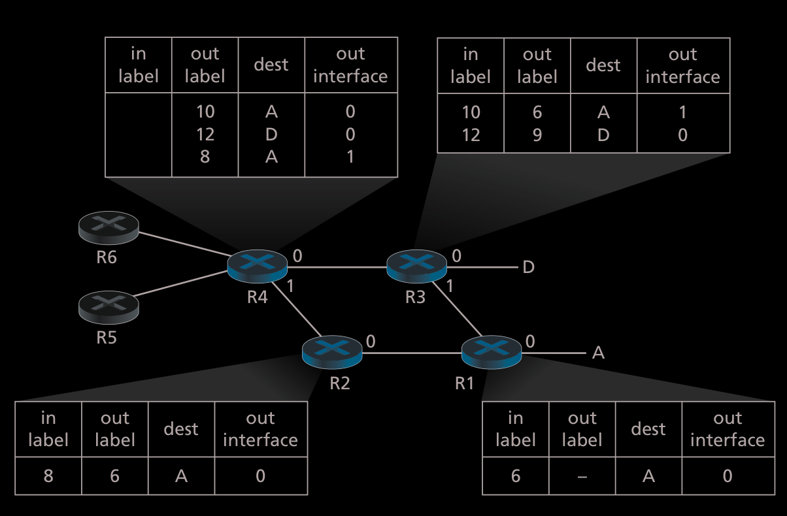

# Link Layer
The link layer is responsible for sending datagrams in devices that are physically adjacent.   

## [NIC](notes/NIC.md)

## Error detection and correction 
- D: datagram   
- EDC: Error detection and Correction bits  
 

### [Parity Checks](notes/Parity%20Checks.md)

## Multiple Access Links and Protocols 
- **Point-to-point link**: 1 sender and 1 receiver  
- **broadcast link**: Multiple senders and Multiple receivers in one shared channel   
- **Multiple Access Problem**: How to coordinate data in a broadcast link  
- **Collision**: when 2 packets are received at the same time by the same receiver.  

### Channel Partitioning Protocols 

#### [TDM](notes/TDM.md)

#### FDM 
> Frequency-division multiplexing

Cut the whole channel throughput to smaller frequencies, $N$, now there are no collisions.  
Suffer the same problem as **TDM**, if there is only one node using the channel, you are only using $\frac{R}{N}$.  

#### CDMA 
> code division multiple access

Encode each node and you are able to broadcast simultaneously.  

### Random Access Protocols 

#### ALOHA
> A decentralized protocol that uses a biased coin in order to retransmit frames. 

Send the frame in its entirety, if there is a collision, wait a frame time, then have a chance of sending a frame with $1 - p$.  

#### Slotted ALOHA

> Similar to pure ALOHA. Notice that slots are only "good" when there is only one frame being used. The efficiency is pretty low.   

#### CSMA 
> Carrier Sense Multiple Access
> This is also called CSMA/CD (Carrier Sense Multiple Access with Collision Detection)

| Image | Description |
| -------------- | --------------- |
|  | Carrier Sensing: listen before speaking. Collision Detection: Stop talking if someone else is talking  |

> The reason that collisions happen in the first place is because of propagation delay 

##### The process
1. Is no one using this? 
2. I am going to use it. 
3. Oh someone else is using it? Mb
4. Stop using it 
5. Repeat if you have not completed using it.  

##### How long to wait before using it again? 
Should be a random time, but how long? 
If there are not a lot of collisions, short time, if there are a lot of collisions, a long time.  

Use the [Binary Exponential Backoff](notes/Binary%20Exponential%20Backoff.md) algorithm:  
> For Ethernet, the actual amount of time a node waits is K * 512 bit times (K times the amount of time needed to send 512 bits into the Ethernet) and the maximum value that n can take is capped at 10. e.g., 5.12 microseconds for a 100 Mbps Ethernet

### Switched Local Area Networks 

#### [MAC Address](notes/MAC%20Address.md)

#### ARP
> A way to translate between MAC addresses and IP addresses.  
> Since it uses both the Link Layer Address and IP Address, it is in between the [Network Layer](notes/Network%20Layer.md) and the Link Layer.  
> I like to think about it as to how [DNS](notes/DNS.md) works

If two hosts are in the same [Subnet](notes/Subnet.md), and one host wants to send a Datagram to another, you must put both the IP address and the MAC address.  

- Sender in the same LAN: Takes in a IP address as input and gets back the MAC address as a result.  
- Each host and router saves the results in a table.   

##### ARP Query 
If a host wants to get a MAC address it makes an **ARP Packet**.  
Send this query to the **Broadcast Address**.  
Any host that can resolve the query sends back the response. The response is a standard frame, instead of a broadcast frame.  

##### Sending a Query off the [Subnet](notes/Subnet.md)

> For each router interface there is also an ARP  module (in the router) and an adapter. Some traversal is needed in order to get the mac address from one subnet to another.  

Example: Suppose the host at the top left wants to send a datagram to the host on the bottom right.  
1. needs to get the mac address of the router interface at the left side, `E6`, by using ARP.  
2. Now the host creates a dataframe addresses to the host at the bottom right.  
3. The router uses a forwarding table to send the datagram to the correct host.  

#### [Ethernet](notes/Ethernet.md)

#### Link Layer Switches 
> Receive incoming link layer frames and forwards them to the output link

- Eliminates collisions 
- Able to mix in legacy technology 

##### Switch Table 
Entry in the switch table contains  
1. a MAC address
2. the switch interface that leads toward that MAC address
3. the time at which the entry was placed in the table

##### Self Learning 
> The switch table is able to dynamically create its own table. 

Initially its empty, but as frames come in, the table fills up, and as entries are not used, the entries are deleted.  

#### VLAN
> Virtual Local Area Networks

Some problems with interconnected switches: 
- Lack of Traffic Isolation: 
  - Broadcast frames go to the whole network.  
  - Security concerns when the whole network is connected together.  

Solution: Divide the traffic into groups with each port being a host and certain ports being designated to certain groups. 

> How do these groups talk to each other? 

Use a **VLAN switch port**, on port 1 and connect it to an external router, then both of these groups can communicate through that port.  

> What If I want groups to talk to eachother but they are in a seperate location? 

Use **VLAN Trunking** 

> How does a switch know  that a frame arriving on a trunk port belongs to a particular VLAN?

Ethernet frame with a four-byte VLAN tag added into the header

### Link Virtualization: A Network as a Link Layer 

#### MPLS
> Multiprotocol Label Switching

[video](https://www.youtube.com/watch?v=BuIWNecUAE8)  

The best way to think about this and find its uses, is to think of traditional delivery.  
If a package has to be opend up to figure out where it has to be sent next, this would be time consuming, but this is also how packet forwarding works in the internet, you have to extract the information in order to use it.  
With **MPLS**, you can just stick a label on top of the package(or in our case add an additional header), and you can quickly figure out where to send the package, without having to open up the package.  

> [!NOTE]
> The traditional way of getting the destination is to use the [Longest Prefix Matching](notes/Longest%20Prefix%20Matching.md) on the **IP header** 

| Image | Desc |
| -------------- | --------------- |
|  | Predetermines the routes in which datagram will take based on a fixed-length label. However, because it adds on an additional header, some routers are will not be cabaple of handling this, so some will have this capability, and some will not. |

 
