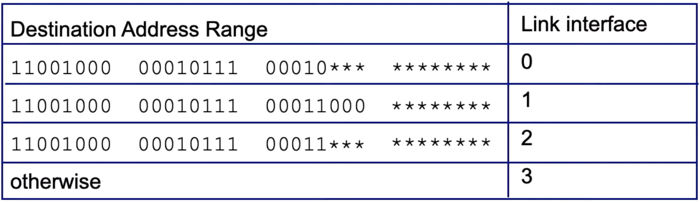
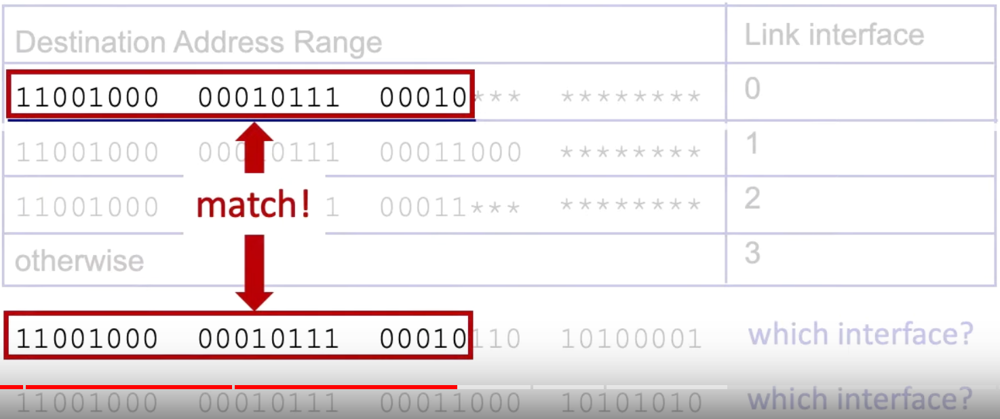
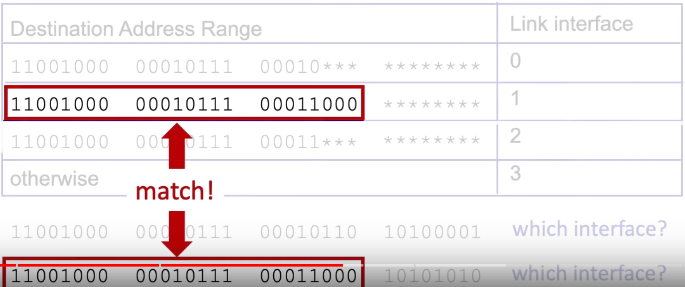

# Longest Prefix Matching
> Most specific Match

When looking for forwarding table entry for given destination address, use longest address prefix that matches destination address

## Example 
 
 
 
Notice that for this second one, that it matches the third one, but the *longest* one is the second address range
