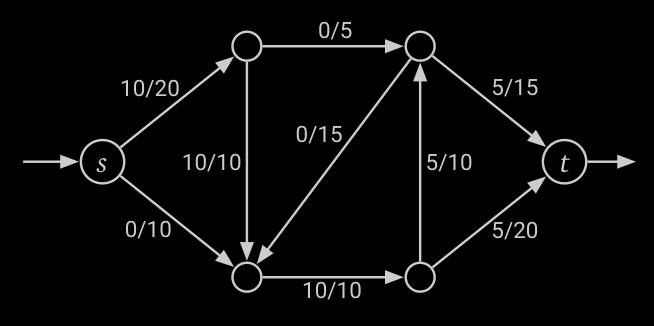
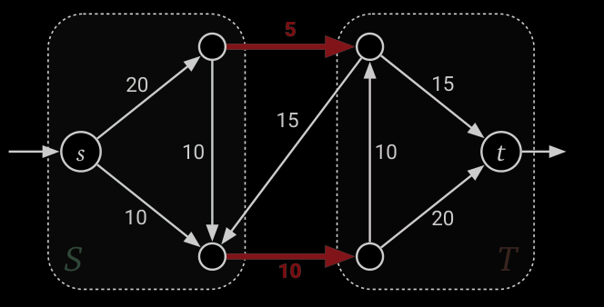

# Minimum Cuts

Partition the flow network into 2 subsets, such that the flow from $s$ to $t$ is minimized.  
This helps with the [Maxflow-Mincut Theorem](notes/Maxflow-Mincut%20Theorem.md)  

Example [Flow Network](notes/Flow%20Network.md): 

| Flow | Min Cut|
| -------------- | --------------- |
|  |  |

