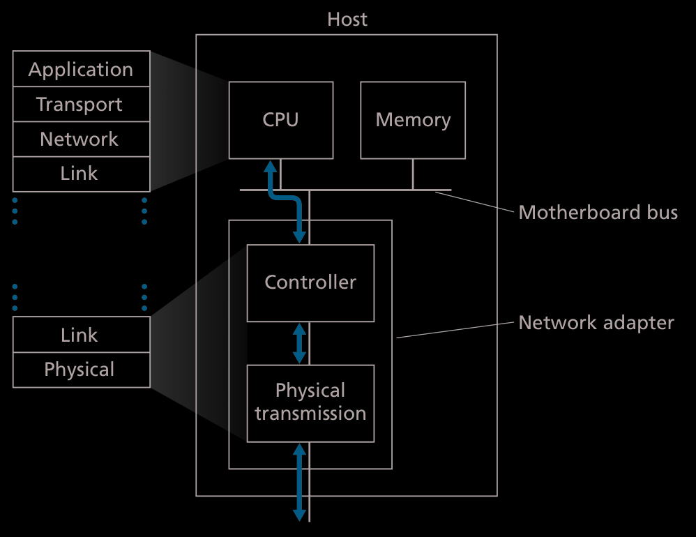

# NIC
> Network Interface Card

This is where the **Link Layer** is implemented.  
Every device capable of having a **NIC** runs the **Link Layer**.  
Uses a combination of both hardware and software.  
 

I like to think about this process as how the Onion Router works, adding layers and then removing them.  

## Sending 
> In the image, the flow goes from top to bottom. 

Takes the datagram that has been made, and encapsulates it into a link layer frame, setting the additional fields so the link layer can use it.  

## Receiving 
> Flow: Bottom to top

Receives the frame and extracts the contents from the link layer frame.  
If the error header is set, error handling is used.  

