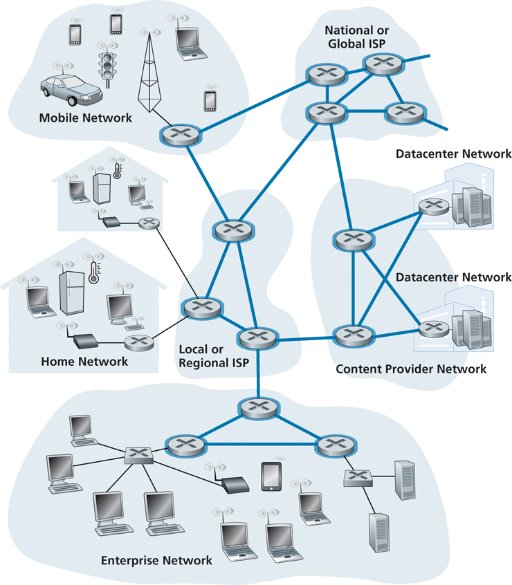

# Network Core

| Image | Explanation |
| -------------- | --------------- |
|  | the mesh of packet switches and links that interconnects the Internet’s end systems |

## Packet Switching
To send a message from a source end system to a destination end system, the source breaks long messages into smaller chunks of data known as [Packets](./Packets.md).
Between source and destination, each packet travels through communication links and [Packet Switches](./Packet-Switches.md).  
To determine how long it will take to reach the destination you can use this equation
$$
\frac{L}{R}  
$$
Where L is the bits and R is the transmission rate in bits per second

## [Queuing Delay](notes/Queuing%20Delay.md) and Packet Loss
Packets go to routers one by one.  
If the router still has not sent out the packet that needs to be sent out, a queue will form.  
Because of having to wait in line to be sent out, a queue delay will occur.  
Routers have a limited amount of memory, so if a packet can not be stored in the back of the queue, packet loss will occur.  

## Circuit Switching
This is an alternative version to sending packets.  
When communication needs to be sent, the lines are "reserved".  
Because the lines are reserved, there are less total capable uses of using the lines. 
An example: lets say you have 1 gb per second over a connection, if you have 10 users, you will need to reserve 10 lines. 
Now if you have 100 users, all coming online at different times(the chance of them all coming online is quite low), then you can have 100 users. 

