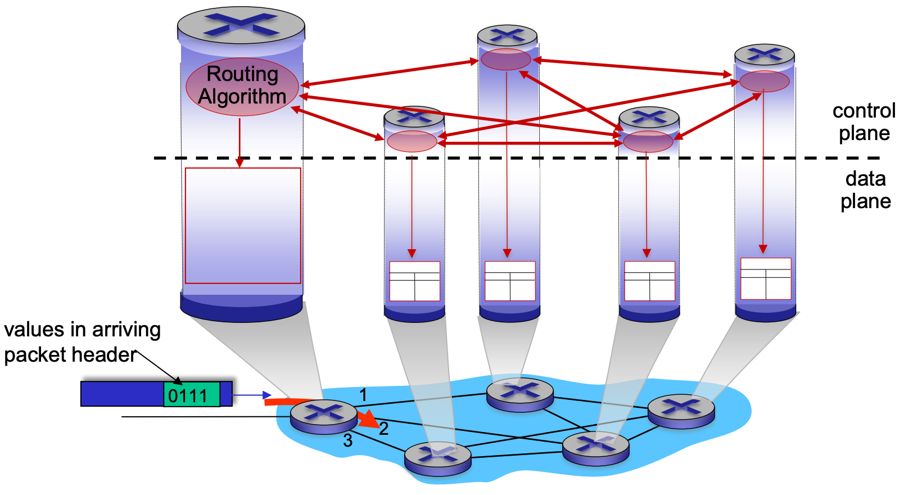
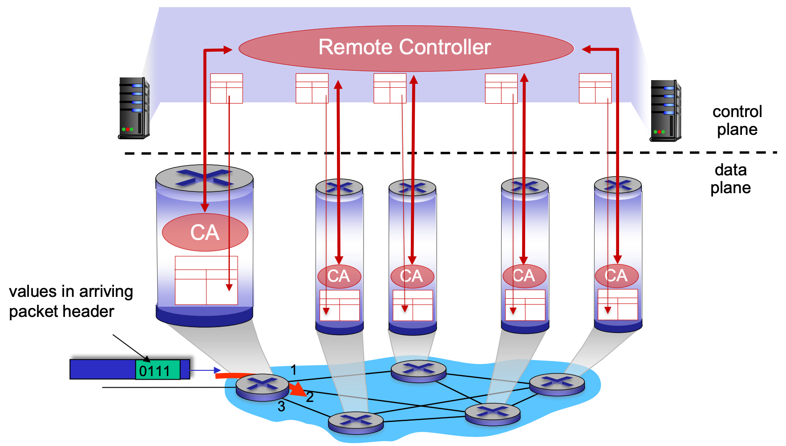

# Network Layer
[Overview Video](https://www.youtube.com/watch?v=olbr3WZwrdU) 
> Move packets from a sending host to a receiving host

## Transport Segment and Network Layer Protocols
- **transport segment from sending to receiving host**
  - **sender**: encapsulates segments into datagrams, passes to link layer
  - **receiver**: delivers segments to transport layer protocol
- **network layer protocols in _every Internet device_**: hosts, routers
- **routers**:
  - examines header fields in all IP datagrams passing through it
  - moves datagrams from input ports to output ports to transfer datagrams along end-to-end path

## Routing and Forwarding
### Routing 
Determine route taken by packets from source to destination  

### Forwarding
Move packets from a router's input link to appropriate router output link

## Control Plane 
> Network-wide logic  

Determines how datagram is routed among routers along end-to-end path from source host to destination host
two control-plane approaches:
### **Traditional routing algorithms**: 
Implemented in [Router](notes/Router.md) 
 

### **Software-defined networking (SDN)**: 
implemented in (remote) servers
 

## Data Plane 
  - _local_, per-router function
  - determines how datagram arriving on router input port is forwarded to router output port

## Service Model 
> Fuck it, we ball

The internet is a **best effort service model** 
- **simplicity of mechanism** has allowed Internet to be widely deployed and adopted
- Sufficient **provisioning of bandwidth** allows performance of real-time applications (e.g., interactive voice, video) to be "good enough" for "most of the time"
- **replicated, application-layer distributed services** (datacenters, content distribution networks) connecting close to clients' networks, allow services to be provided from multiple locations
- **congestion control** of "elastic" services helps

