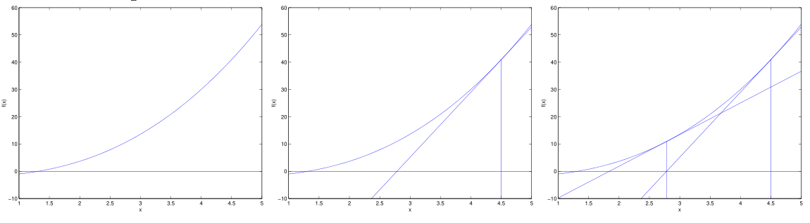

# Newtons-Method
Video explanation: [Here](https://youtu.be/W7S94pq5Xuo?si=hYQ9YIRx_kx5eEMS)  
We want to find the value of a function, such that $f(\theta) = 0$  

$$
\theta := \theta - \frac{f(\theta)}{f'(\theta)}
$$

What if we want to find a way to maximize a function?   
Recall that when the first derivative of a function is $0$, it is the local maxima or minima. 

## Maximizing a Function 
Let $f(\theta) = l'(\theta)$ 
$$
\theta := \theta - \frac{l'(\theta)}{l''(\theta)}
$$

