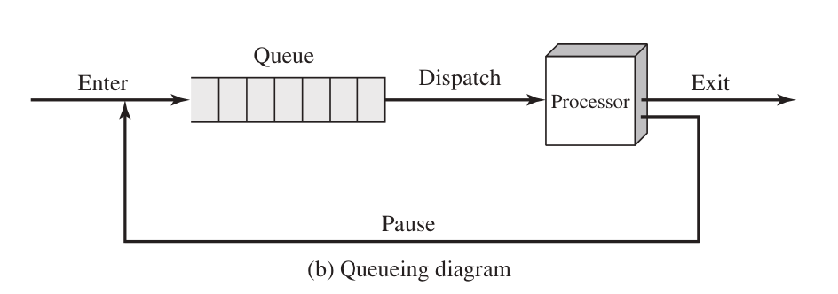

# Operating System
An OS is a program that controls the execution of application programs, and acts as an interface between applications and the computer hardware. It can be thought of as having three objectives
- Convenience: An OS makes a computer more convenient to use. (unless you use Arch Linux)
- Efficiency: An OS allows the computer system resources to be used in an efficient manner.
- Ability to evolve: An OS should be constructed in such a way as to permit the effective development, testing, and introduction of new system functions without interfering with service.

## [Process](./Process.md)
Each process must be represented in some way, so the OS can keep track of it. That is, there must be some information relating to each process, including current state and location in memory; this is the process control block
Processes that are not running must be kept in some sort of queue, waiting their turn to execute.

