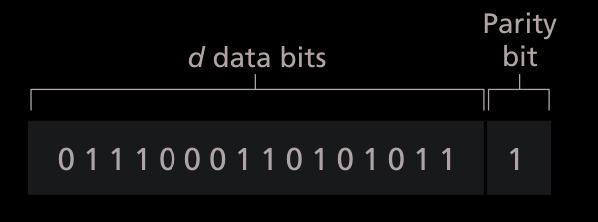
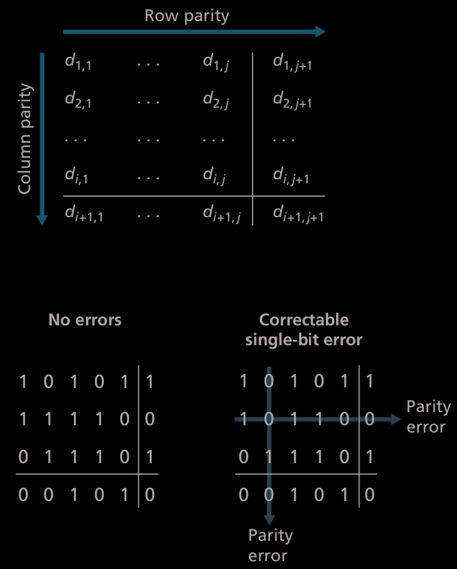
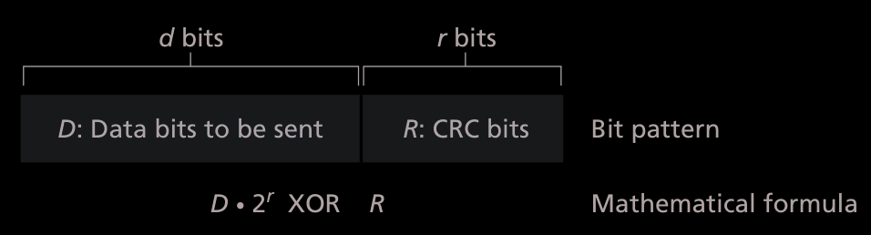

# Parity Checks
#### Single Parity 
Both parties agree on what type of parity they want to use, even or odd.  
The sender includes an additional bit such that the 1's in the data bits will be even or odd. 
 
> Even parity 

If there is an odd number of bits, but an even parity was agreed upon, then an error was detected.  
What if two bits were flipped? Would it still be even?  
It would, and in fact most errors don't occur in a single bit but in ***bursts***.  

#### 2D Parity 
 
> 2D even parity 

If a single bit error is detected, we are able to not only detect it, but also **correct** it. 
Can detect(but not correct), any combination of 2 bit errors in the packet.  

The ability of the receiver to both detect and correct errors is known as forward error correction (FEC)

#### Cyclic Redundancy Check (CRC) 
[Neso Academy Video](https://www.youtube.com/watch?v=A9g6rTMblz4) 
 
Sender and receiver must agree upon a r + 1 bit pattern, known as a generator, $G$  
The leftmost bit of $G$ must be 1.  
##### Sender 
Send r additional bits to d, and make sure that is divisible by $G$.  

##### Receiver
If $\frac{d + r}{G}$ = 0, there is **not** an error, otherwise there is an error. 

#### Checksumming 
Take a look at [Internet Checksum](notes/Internet%20Checksum.md)
> Why is checksumming used at the transport layer and cyclic redundancy  check used at the link layer?  

[Transport Layer](notes/Transport%20Layer.md) error detection is implemented in software, it is important to have a simple and fast  error-detection scheme. Error detection at  the link layer is implemented in dedicated hardware in adapters, which can rapidly  perform the more complex CRC operations

