# Parser

- There are two distinct **goals of syntax analyzer or parser**:
  1. Checking the input program to **determine whether it is syntactically correct**.
  2. **Producing a complete parse tree**, or at least trace the structure of the complete parse tree, for syntactically correct input.

- The **two broad classes of parsers** are **top-down**, in which the tree is built from the root downward to the leaves, and **bottom-up**, in which the parse tree is built from the leaves upward to the root.

---

### Notational conventions for grammar symbols and strings

1. **Terminal symbols**—lowercase letters at the beginning of the alphabet
2. **Nonterminal symbols**—uppercase letters at the beginning of the alphabet
3. **Terminals or nonterminals**—uppercase letters at the end of the alphabet
4. **Strings of terminals**—lowercase letters at the end of the alphabet
5. **Mixed strings (terminals and/or nonterminals)**—lowercase Greek letters

## Top Down Parsing 
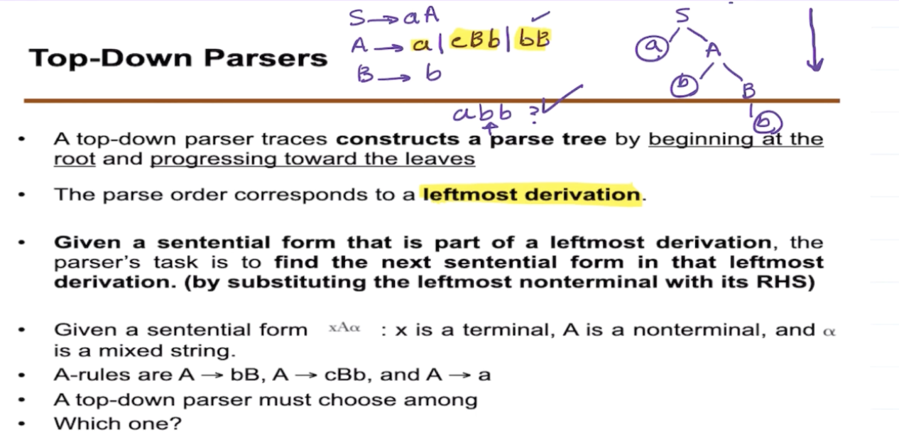 

### Pairwise disjointness Test
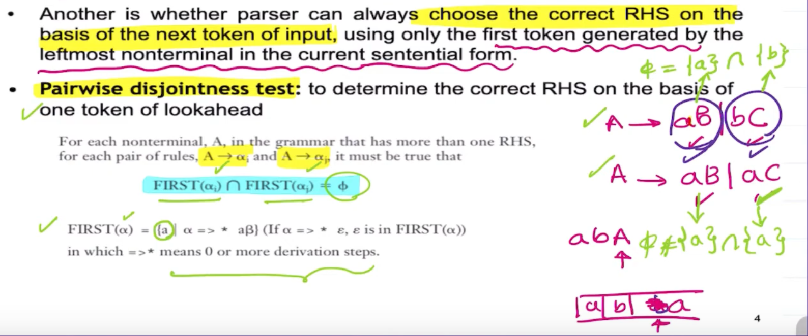 
The top A can be determined because the first letter of each or is unique, but the bottom `A` fails the test because we can not determine if the next letter is `aB` or `ac`.  

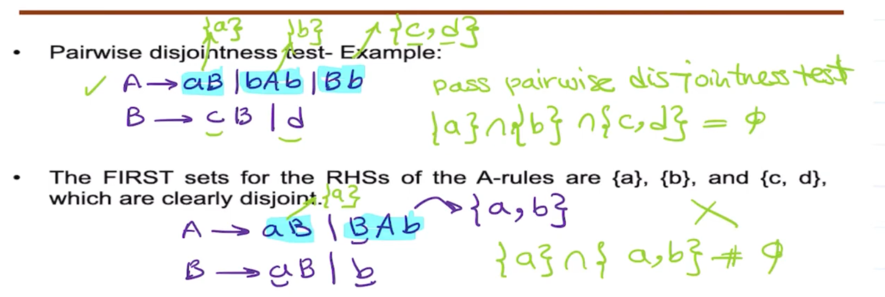 
Take every start of every `or`, then if their conjunction, denoted with $\cap$, is $\varnothing$, then it passes the test.   

#### How to make it Pass
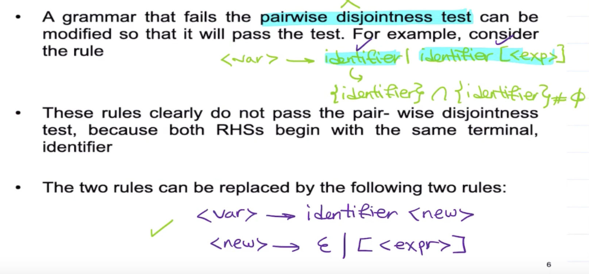 

## Bottom Up Parsing
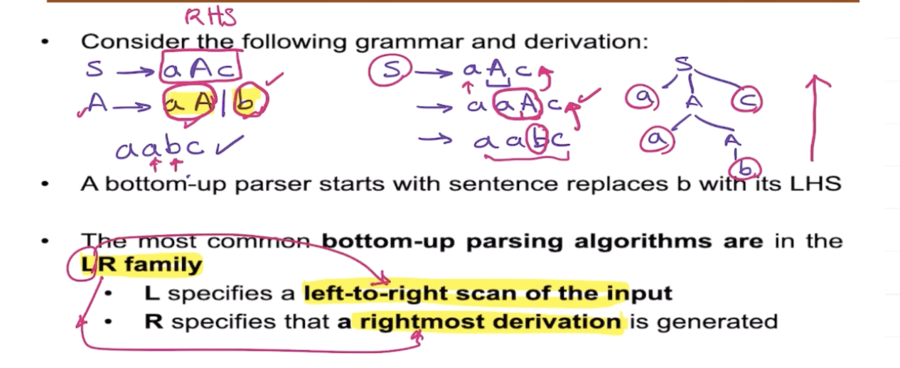 

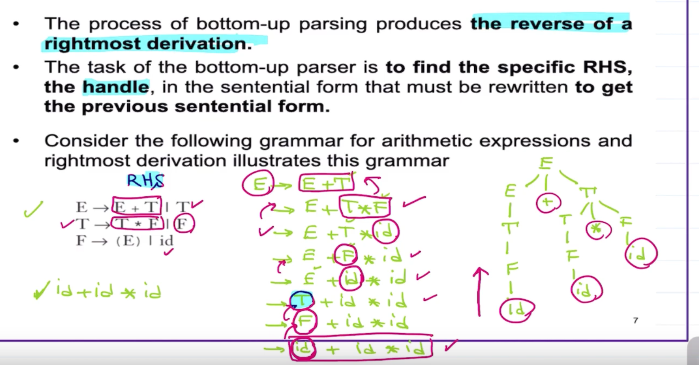 
They way you derive the middle part is by expanding out and making the right most side the new "marker". Indicate the marker with ', then refer to the left side, and keep constructing until you reach the identifier and you cant exapnd anymore. From here you go towards the left and mark the left expression with the '. You can see this being done in line 3. 

### How to find the Handle
> "handle" is a substring of the rightmost sentential form that matches the right-hand side of a production rule, and its reduction is part of a valid derivation.

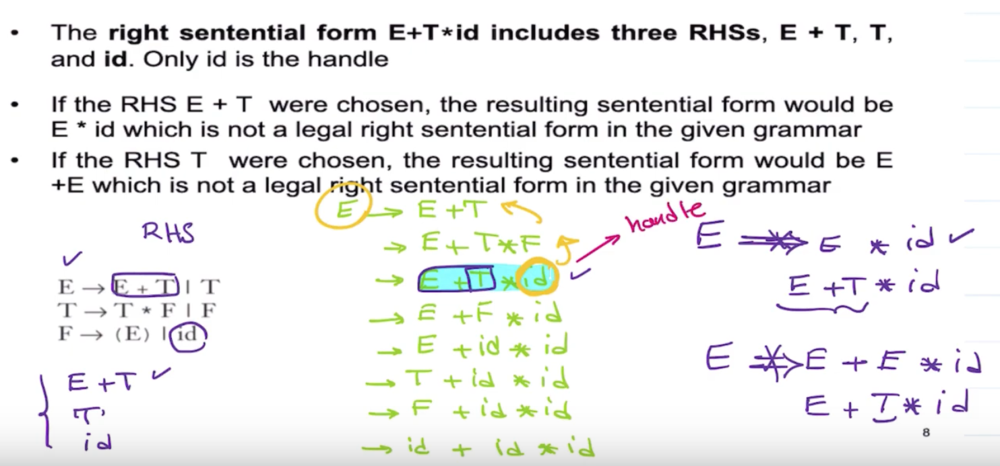 
So you are substituting backwards in order to find a valid form.  

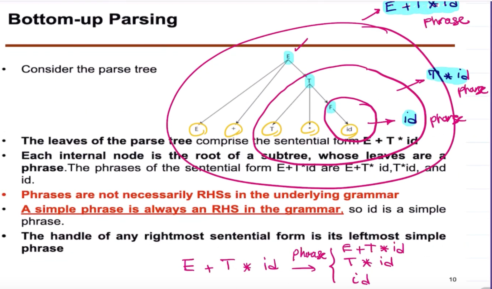 
- id here is the simple phrase
- If you have multiple simple phrase, the left most simple phrase is the handle.  

#### Example
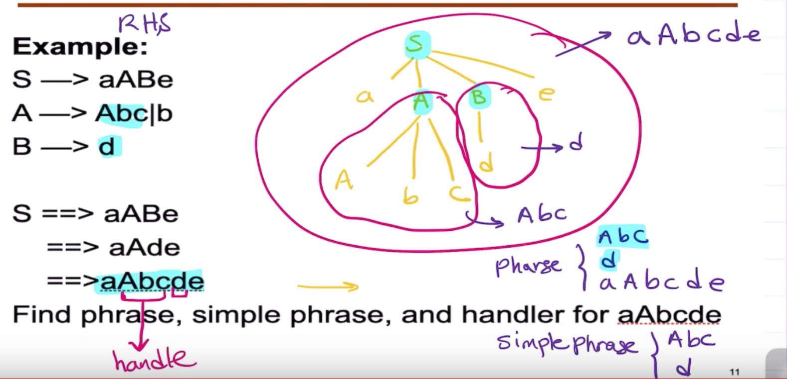 

### LR Parser
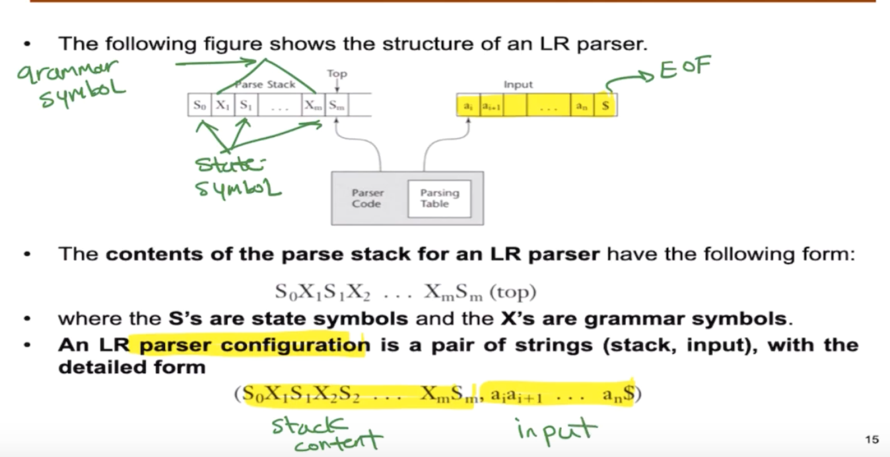 
Bottom Up Parsers are often called Shift-Reduce Algorithms.  
- Uses a Stack to achieve this

Action Table: This table directs the parser's actions based on the current state and the next input symbol. 
Actions include:

- Shift: Push the current input symbol onto the stack and transition to a new state x.
- Reduce: Reduce a portion of the stack according to the production rule x.
- Accept: If the parser reaches this action, it signifies that the input is valid and can be accepted.
- Blank entries: Indicate an error state.

Goto Table: This part of the table is used after a reduction to determine which state to transition to based on the non-terminal produced by the reduction.

#### Example 
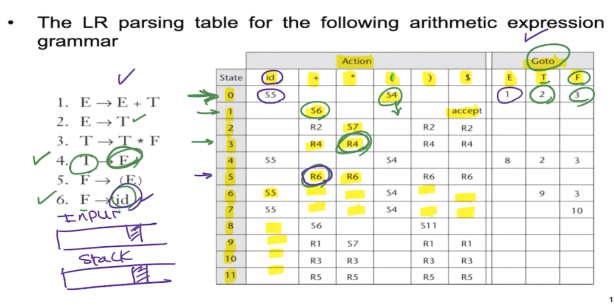 
> Reduce means we found a handle
 
| Stack               | Input            | Action                        |
|---------------------|------------------|-------------------------------|
| 0                   | id + id * id $   | Shift 5                       |
| 0 id 5              | + id * id $      | Reduce 6 [use Goto (0, F)]     |
| 0 F 3               | + id * id $      | Reduce 4 [use Goto (0, T)]     |
| 0 T 2               | + id * id $      | Reduce 2 [use Goto (0, E)]     |
| 0 E 1               | + id * id $      | Shift 6                       |
| 0 E 1 + 6           | id * id $        | Shift 5                       |
| 0 E 1 + 6 id 5      | * id $           | Reduce 6                      |
| 0 E 1 + 6 F 3       | * id $           | Reduce 4 [use Goto (6, T)]     |
| 0 E 1 + 6 T 9       | * id $           | Shift 7                       |
| 0 E 1 + 6 T 9 * 7   | id $             | Shift 5                       |
| 0 E 1 + 6 T 9 * 7 id 5 | $            | Reduce 6 [use Goto (7, F)]     |
| 0 E 1 + 6 T 9 * 7 F 3 | $             | Reduce 3 [use Goto (6, T)]     |
| 0 E 1 + 6 T 9       | $                | Reduce 1 [use Goto (0, E)]     |
| 0 E 1               | $                | Accept                        |

