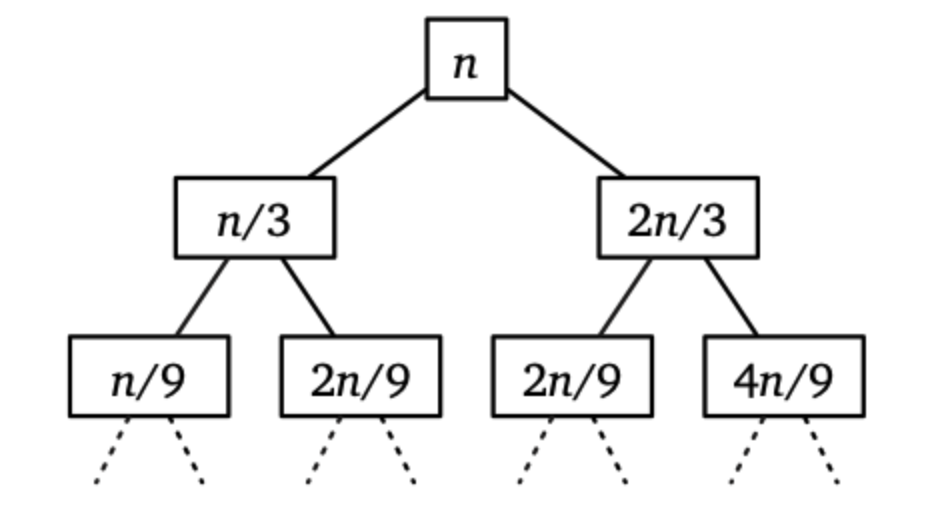

# Quicksort
A [Divide-And-Conquer](./Divide-And-Conquer.md) [algorithm](./Algorithms.md).  

1. Choose a pivot element from the array. 
2. Partition the array into 3 subarrays
  - elements smaller than the pivot. 
  - The pivot itself 
  - all the elements greater than the pivot
3. [Recursion](./Recursion.md) on items smaller than the pivot, and larger than the pivot.  

> Rank: The index of where the element ends up after it is partitioned.  

## Median Selection 
In order for quicksort to work well, have it towards the middle.  
- Recurse on the side that might have a media.  

### Using [Recursion Trees](notes/Recursion%20Trees.md) 
In order to show that the partition will work for our partition, we can use a Recursion Tree.  
For example, suppose we knew somehow that the pivot always ends up in the middle third of the sorted array. Then even at its most unbalanced, the worst runtime recurrence we may get would look something like:  
$$
T(n) \le T(n/3) + T(2n/3) + \Theta(n)
$$
 

### K Selection 
- Return element of rank K

### Median of Medians 
devide of array into 5 blocks, each of its five elements.  
Find the median of each block 
Recursively find the median of medians, to pass to quick select

