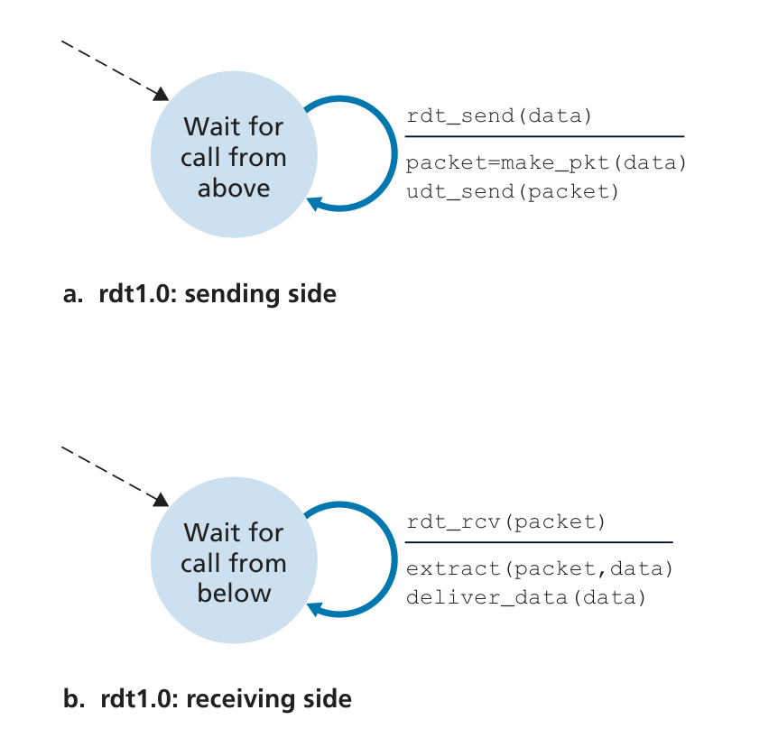
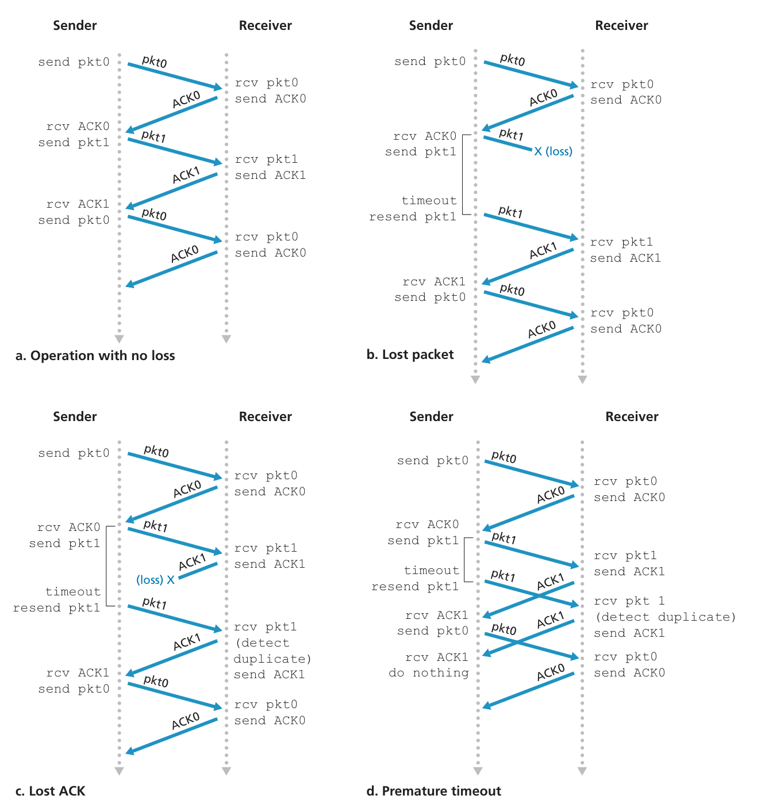

# Reliable Data Transfer
[Part 1](https://www.youtube.com/watch?v=nyUHUtmxWg0) 

## rdt 1.0 
 
- assumed that the receiver is able to  receive data as fast as the sender happens to send data. Thus, there is no need for the  receiver to ask the sender to slow down! 
- all packet flow is from the sender to receiver; with a perfectly reliable channel there is no need for the receiver side to provide any feedback to the sender since  nothing can go wrong!

## rdt 2.0 
A more realistic model of the underlying channel is one in which bits in a packet may  be corrupted.  
bit errors typically occur in the physical components of a network  as a packet is transmitted, propagates, or is buffered
- Ack or NAK could be corrupted 
  - so resend, but its duplicate

## rdt 2.1
Takes care of the case where ACK or NAK is corrupt, by just resending the packet and numbering them 

## rdt 2.2
sequence number on ACK

## rdt 3.0
Channels with errors and losses
- timer, in case packets are lost or delayed 
Alternate between 0 and 1 to determine which one you are sending 

Send them in "chunks"(window packets) and that will determine the amount of numbers you will need in order to get them right.  

 

### Stop and wait 
Uses [ARQ](./ARQ.md) (Automatic Repeat reQuest) protocols for verification.  
- need 2 sequence numbers: 0 and 1 

### Go-Back-N
cumulative ACK: received everything up to N 
if lose one, send up to N 
sending 0 ... 9, N = 4 
if you lose packet 2, send ack that you got packet 1, 
Move window up to 2, and you will send 2 ... 5
- Must use at least n + 1 unique sequence numbers, to avoid edgecase where receiver gets duplicate

### Selective Repeat
Sliding window technique that advances the window depending on the most up to date packet, controlled by the receiver. 
If you have window of 2 ... 5, and you lose packet 2, buffer packets 3 to 5, and dont send those again, just send 2 again.  
Once you get the ACK for 2, shift window to 6 ... 9   

#### Seq numbers needed 
Depends on the size of window
- need 2n sequence numbers
- sequence number space of 4, then you need at least 8 to not send repeats.  

