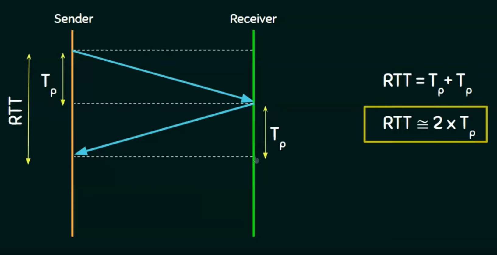

# Round Trip Time
[Neso Academy](https://youtu.be/nT9F-USjtBg?si=FBQgVWtc9x3uEpU5)  

* a.k.a Round Trip Delay Time (RTD).
* It is the length of time it takes for a signal to be sent plus the length of time it takes for an acknowledgement of that signal to be received.
* This time therefore consists of the propagation times between the two points of signal.
* If Tₚ is the Propagation time, then:
$$
RTT = 2 * T_p
$$
 

