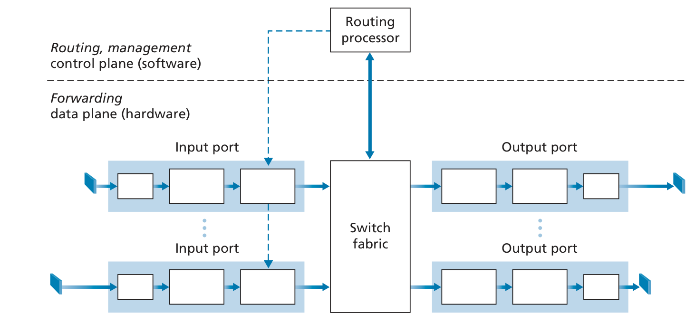
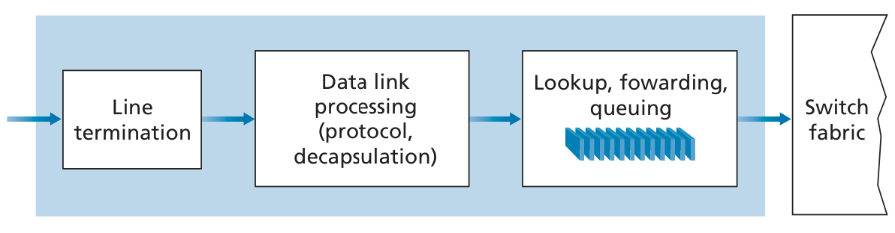
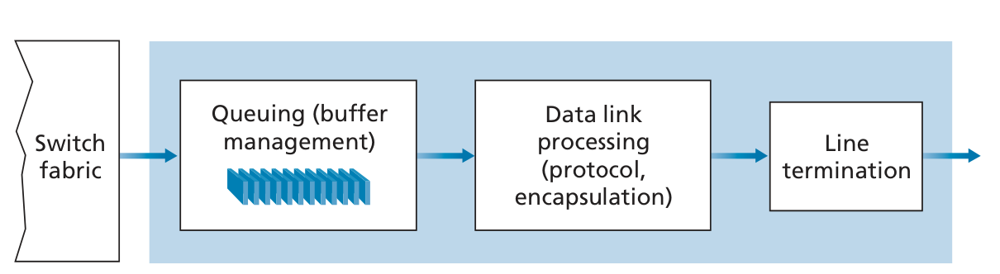
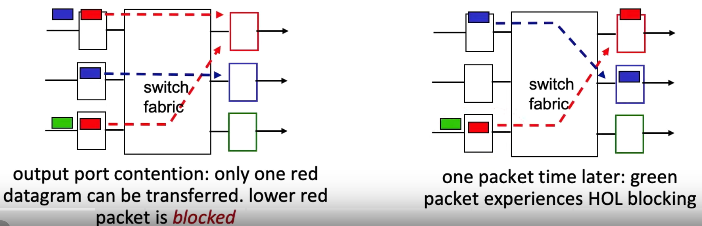
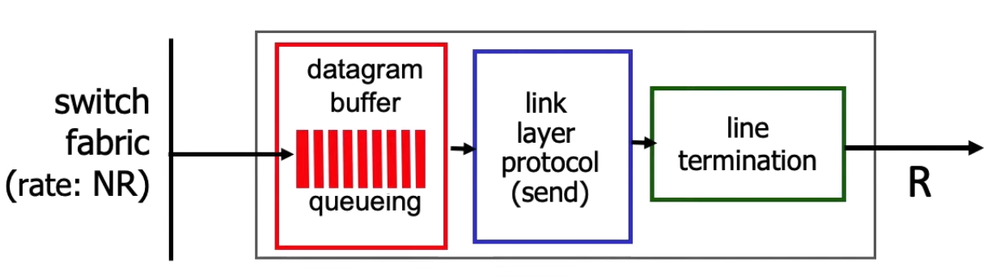

# Router
[Video 1](https://www.youtube.com/watch?v=NfHR94JAO-s) 

## Architecture 
 

### Input Port
 
Physical Layer $\rightarrow$ Data Link Layer $\rightarrow$ Network Layer
- Terminates the physical layer.  
- In the data link layer, bits are assembled into frames.  
- Uses [Longest Prefix Matching](notes/Longest%20Prefix%20Matching.md) for lookup and forwarding.  

### Switching
Network inside of a network router  
Switching rate: rate at which packets can transferred from input to output
#### Types of switching
 

##### Memory
- Traditional Method of switching via a computer.  
- Input and output were traditional I/O devices and handles as interrupts.  
- Packet was copied from the input port to memory, handled there and copied to the outputs buffer.  
- Total memory bandwidth is $B/2$, where $B$ is the total memory bandwidth 
##### Bus
- All outputs receive the packet, but only the one with the matching label keeps the packet.  
##### Interconnection Network
- Controlled by switches. 
- If $A \rightarrow Y$, the switches in between them are closed, and being able to send the packet is possible. 
- Note: if two packets from two different input ports are destined to that same output port, then one will have to wait at the input, since only one packet can be sent over any given bus at a time.

## Queuing 
[video](https://www.youtube.com/watch?v=zfzzz9KQOog) 
 
Some Assumptions: 
- Suppose the transmission line speeds at the input and output lines are $R_\text{line}$
- There are $N$ input lines and output lines.  

### Input Port Queuing 
- Multiple packets can be transferred in parallel as long as their output ports are ***different***.  

#### Head of the Line Blocking
 
The green packet wants to go to the green output, but the red packet is in front of it.  

### Output Queuing 
 
- **Buffering** required when datagrams arrive from fabric faster than link transmission rate.  
**Drop policy**: which datagrams to drop if buffer is full
- **Scheduling discipline** chooses among queued datagrams for transmission  
  - Priority scheduling – who gets best performance, network neutrality

#### How much buffering? 
Too much buffering can increase delays.  
Too little and you will suffer a lot of packet loss.  

## [Priority Queuing](notes/Priority%20Queuing.md)

#### How to classify the packet
Overall, the ISP classifies it.  
If its time sensitive like a TCP connection, it will take higher priority.  
If its something like email, its lower priority.  
You can use the port number in the packet to check these attributes.  

## [Weighted Fair Queuing](notes/Weighted%20Fair%20Queuing.md)
