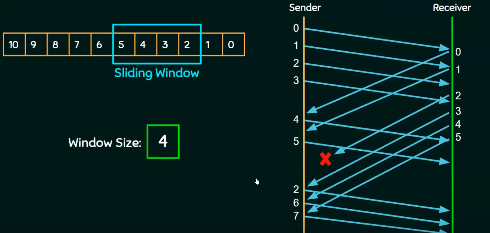

# Selective Repeat
[Neso Video](https://www.youtube.com/watch?v=WfIhQ3o2xow)  
Sliding window technique that advances the window depending on the most up to date **(NECESSARY)** packet, controlled by the receiver.  
If you have window of 2 ... 5, and you lose packet 2, buffer packets 3 to 5, and dont send those again, just send 2 again.  
Once you get the ACK for 2, shift window to 6 ... 9   

#### Example
 
Notice that only packet 2 is sent again.  

#### Seq numbers needed 
Depends on the size of window
- need 2n sequence numbers
- sequence number space of 4, then you need at least 8 to not send repeats.  

