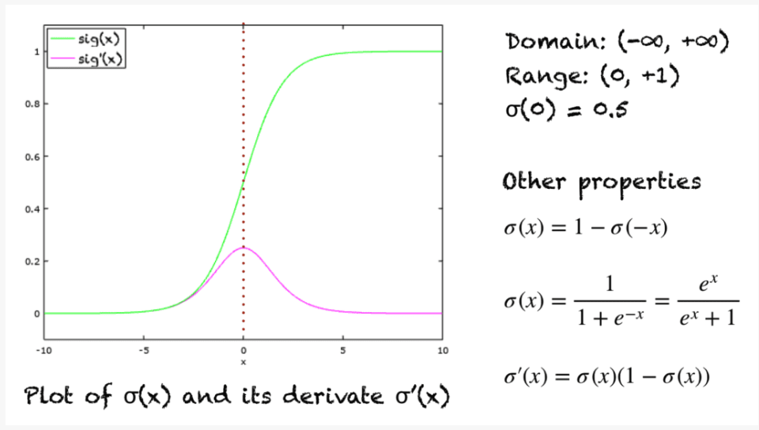

# Sigmoid Function
| Explanation | Properties |
| -------------- | --------------- |
| The graph is in green and the derivative is in pink. This is referred to as a squashing function, because if $x$ is very large or small, the output will be either 0 or 1. | 
|

> Credit for image: https://machinelearningmastery.com/a-gentle-introduction-to-sigmoid-function/

