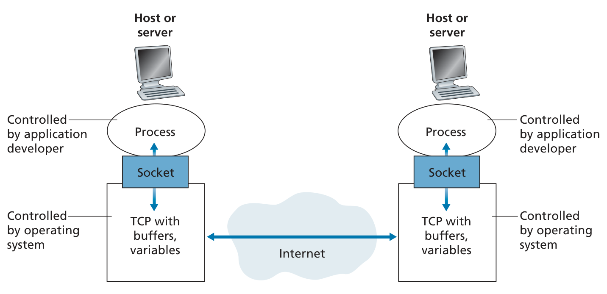

# Socket
Any message sent from one process to another must go through the underlying network.  
A process sends messages into, and receives messages from, the network through a software interface called a socket.

 
