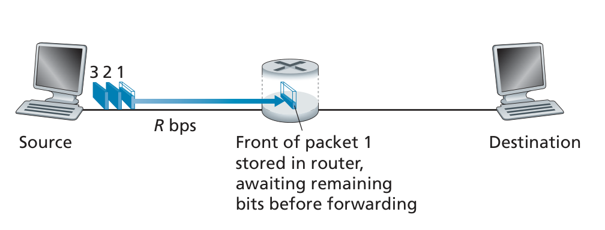

# Store and Forward Transmission
Most packet switches use store-and-forward transmission at the inputs to the links.  
Store-and-forward transmission means that the packet switch must receive the entire packet before it can begin to transmit the first bit of the packet onto the outbound link.
 

