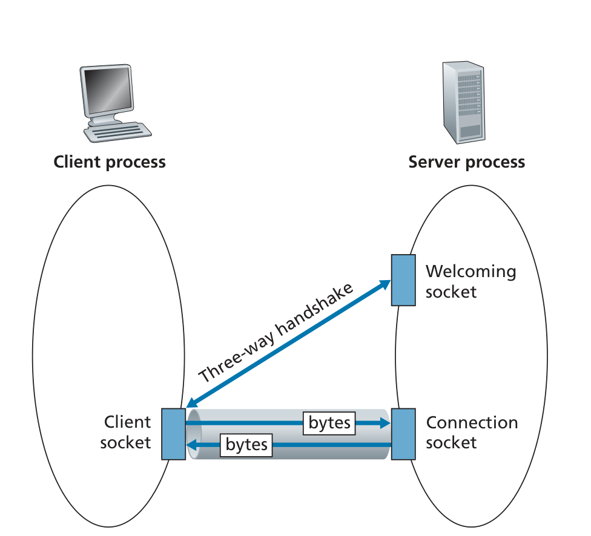
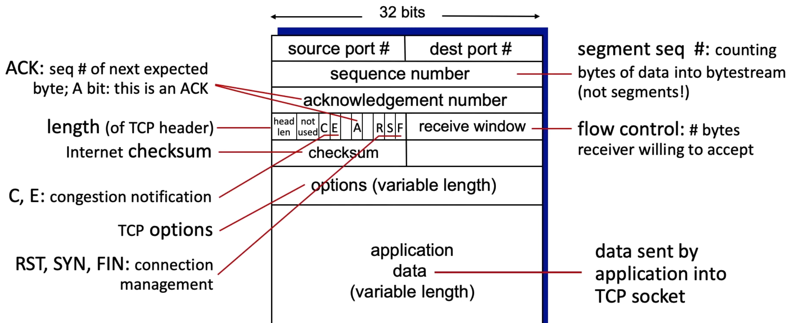
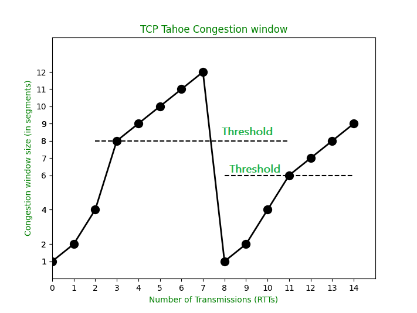
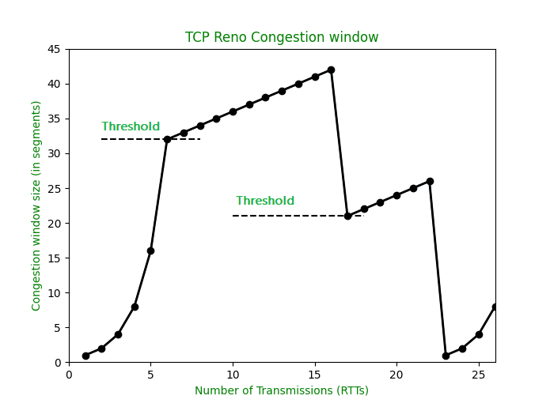
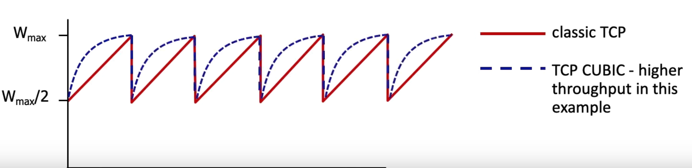
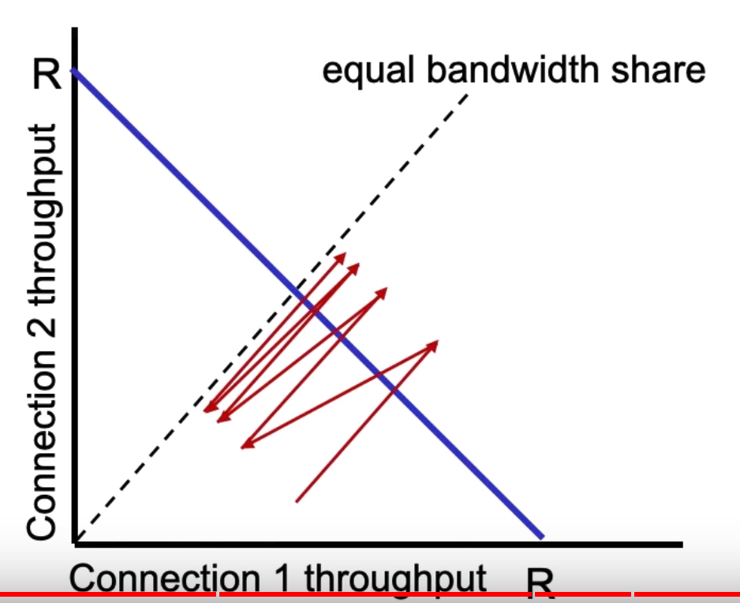

# TCP

## TCP needs 2 sockets 
 

## TCP Reliability 
See [Reliable Data Transfer](notes/RDT.md) for an in depth look.  
- Sender will not overwhelm receiver by using Flow Control.  
 

Size of the segment is determined by the MSS(Maximum Segment Size)
- Determined by the hardware

## TCP round trip time, timeout

### Estimated [RTT](notes/RTT.md) Formula:
$$ \text{EstimatedRTT} = (1 - \alpha) \times \text{EstimatedRTT} + \alpha \times \text{SampleRTT} $$
- **exponential weighted moving average (EWMA)**
- Influence of past samples decreases exponentially fast
- Typical value: α = 0.125  
$\text{Timeout}=2 \cdot \text{EstRTT}$

## Flow control 
- More of a problem with matching speeds
- Receiver controls how much is received.  
- Determined by how much space you have in the client buffer.  
Most of the times, the throughput will be the +-clients_throughput 

## [Reliable Data Transfer](notes/RDT.md)

## TCP Congestion Control 
[video lecture](https://www.youtube.com/watch?v=cIHiSR4j3g4)  

### TCP Tahoe
First TCP variant with congestion control.  
$$
\text{TCP Tahoe} = \text{Slow Start} + \text{AIMD}+ \text{Fast Retransmit}
$$

 

#### Slow Start
- lasts until the congestion window size reaches up to sshthresh
- sshthresh at the start is set to $\infin$
- doubles the congestion window every RTT
> Image: RTT up to 3

#### AIMD
- Additive increase, multiplicative decrease  
- Adds to congestion window by 1 
- Decreases **sshthresh** by 50% of cwnd on packet loss. 
```python
if cwnd < sshthresh: 
  slowstart
else: 
  AIMD
```
> Image: slow incremental increase, 8 to 12 

#### Fast Retransmit
- On triple duplicate ACKs, the congestion window is reduced to 1 segment. 
- The ssthresh is set to half of the previous congestion window size.
> Image: Triple ACK at RTT 7

### TCP Reno 
$$
\text{TCP Reno} = \text{TCP Tahoe} + \text{Fast Recovery}
$$

 

#### Triple Duplicate ACK Loss
Reno does something different compared to Tahoe when it comes to triple duplicate ACK's.  
- It sets the cwnd to half.  
- sets the sshthresh to half
- Additive increase

#### Fast Recovery
- On packet loss detection through Request Time Out(RTO), reset cwnd to initcwnd. 
- `sshthresh` = $\text{cwnd}_\text{start} / 2$
- If the RTO timer expires that means the network is badly congested. So, the cwnd has to be reduced to the initial value in order to recover the network from congestion.
- Slow start from the bottom. 

### TCP Cubic
Instead of a linear increase, exponential and then log at halfway
 

### TCP Fairness
Will every connection share the same amount of throughput?  
Yes! - Because of the additive and multiplicative properties of AIMD
 
> Under fair assumptions this will work, UDP can just go brrr

