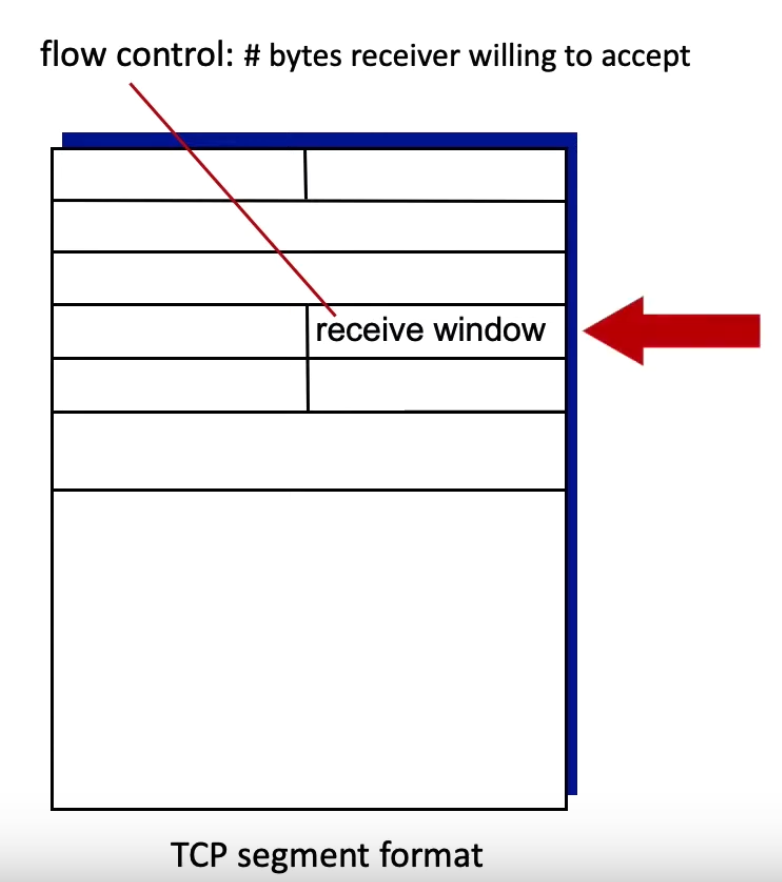
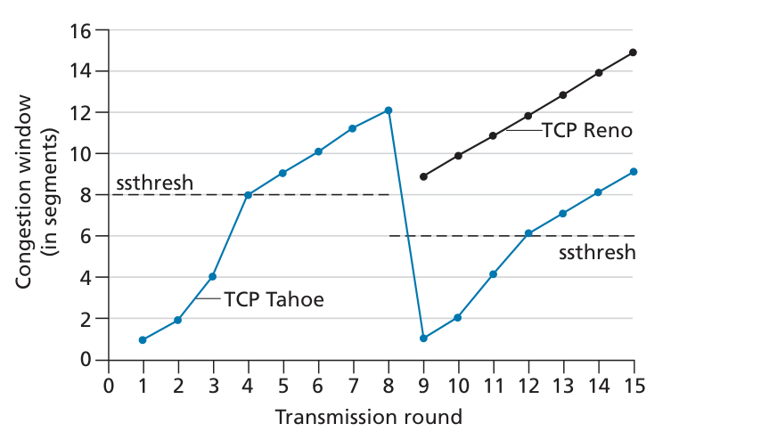
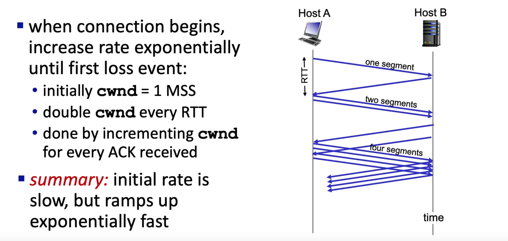

# TCP

## TCP needs 2 sockets 
 

## TCP Reliability 
See [Reliable Data Transfer](notes/RDT.md) for an in depth look.  
- Sender will not overwhelm receiver by using Flow Control.  
 

Size of the segment is determined by the MSS(Maximum Segment Size)
- Determined by the hardware

## TCP round trip time, timeout

### Estimated RTT Formula:
$$ \text{EstimatedRTT} = (1 - \alpha) \times \text{EstimatedRTT} + \alpha \times \text{SampleRTT} $$
- **exponential weighted moving average (EWMA)**
- Influence of past samples decreases exponentially fast
- Typical value: α = 0.125  
$\text{Timeout}=2 \cdot \text{EstRTT}$

## Flow control 
- More of a problem with matching speeds
- Receiver controls how much is received.  
- Determined by how much space you have in the client buffer.  
 

## Reliable Data Transfer 
Take a look at [Reliable Data Transfer](notes/RDT.md)  
### Sliding Window Protocol 

#### Sequence Number 
seq # corresponds to the byte in that segment.  

## TCP Congestion Control 
[video lecture](https://www.youtube.com/watch?v=cIHiSR4j3g4)  

### AIMD

Additive increase, multiplicative decrease  
Also known as TCP Reno.  
A sea saw approach, trying to find the right balance between sending as much as you can without overwhelming the network.    

### sshthresh
shorthand for “slow start threshold”  
- if there is a loss event (i.e., congestion) indicated by a timeout, the TCP sender sets the value of cwnd to 1 and begins the slow start process anew.  
- It also sets the value of ssthresh to cwnd/2—half of the value of the congestion window value when congestion was detected.  
- The second way in which slow start may end is directly tied to the value of ssthresh.  
Since ssthresh is half the value of cwnd when congestion was last detected, it might be a bit reckless to keep doubling cwnd when it reaches or surpasses the value of ssthresh.  
Thus, when the value of cwnd equals ssthresh, slow start ends and TCP transitions into congestion avoidance mode.  
 

### Fast Recovery 
- When TCP Reno detects segment loss through triple duplicate ACKs, the congestion window is halved, and the protocol enters fast recovery.
- If TCP Reno detects loss due to a timeout, it assumes severe network congestion and resets the congestion window to 1 segment, entering slow start once again. This leads to a much sharper reduction in the window size
- In fast recovery, the value of cwnd is increased by 1 MSS for every duplicate  ACK received for the missing segment that caused TCP to enter the fast-recovery  state. 
- `cwnd = Threshhold + 3*MSS` because of the triple ACK

### TCP Slow Start
If packet loss occurs, decrease the rate by half, otherwise increase it by adding a segment.  
 

### TCP Cubic
Instead of a linear increase, exponential and then log at halfway
 

### TCP Fairness
Will every connection share the same amount of throughput?  
Yes! - Because of the additive and multiplicative properties of AIMD
 
> Under fair assumptions this will work, UDP can just go brrr

### TCP Vegas
Senses the congestion in the network before any packet loss occurs and instantly it decreases the window size. So, TCP Vegas handles the congestion without any packet loss occurring.

- Use `RTT` to get a feel for the congestion situation and base your output based off of that.   

### Router Centric Congestion Avoidance 
- Modify both routers and hosts

#### DECbit Scheme

#### ECN
Explicit Congestion Notification 
- Network assisted congestion control 
two bits in IP header marked by <u>network router</u> to indicate congestion.  

#### RED
Random Early Detection 
- Notify the source that the queue is about to become full, to prevent more loss

