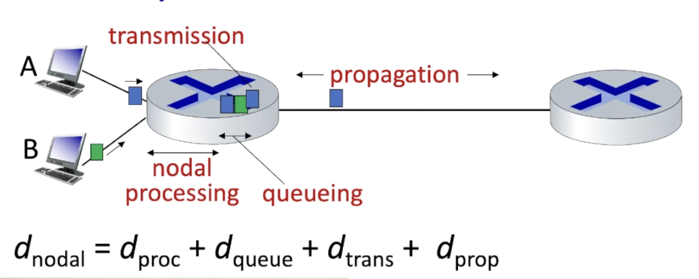

# Total Node Delay
 

There are 4 total parts that contribute to the total amount of delay that a packet will suffer from.  
It can be described understood in this formula: 
$$
d_\text{nodal} = d_\text{proc} + d_\text{queue} + d_\text{trans} + d_\text{prop}
$$

## Processing Delay 
The time required to look at the packets header, and decide where to send the packet in the route.  
Also checks for errors.  
The whole process is done in microseconds.  

## Queuing Delay
This is the buffer that the packet will wait in as it tries to go out.  

## Transmission Delay 
This is the amount of time it takes to push the packet that is in front of the queue into the link. This is usually done very quickly, and can be derived by getting the length of the packet $L$ and dividing by the transmission rate $R$. The result being: $\frac{L}{R}$

## Propagation Delay 
The time it takes to actually traverse to the other router.  
This traverses very quickly, as it is close to the speed of light. $\frac{d}{s}$
