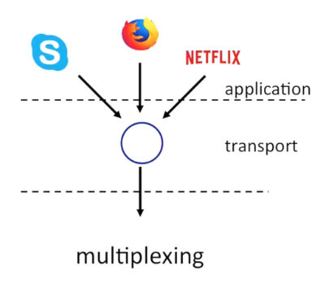
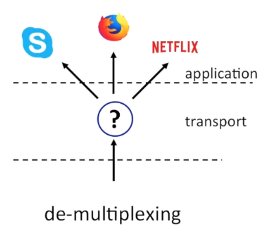

# Transport Layer
A transport-layer protocol provides for logical communication between application [Process](./Process.md) running on different hosts. By logical communication, we mean that from an application’s perspective, it is as if the hosts running the processes were directly connected; in reality, the hosts may be on opposite sides of the planet, connected via numerous routers and a wide range of link types.

Internet makes two distinct transport-layer protocols available to the application layer.  
[TCP](./TCP.md) and [UDP](./UDP.md)

## Multiplexing and Demultiplexing 
Happens in all layers of the network stack.  
| Multiplexing | Demultiplexing |
| -------------- | --------------- |
|  |  |

