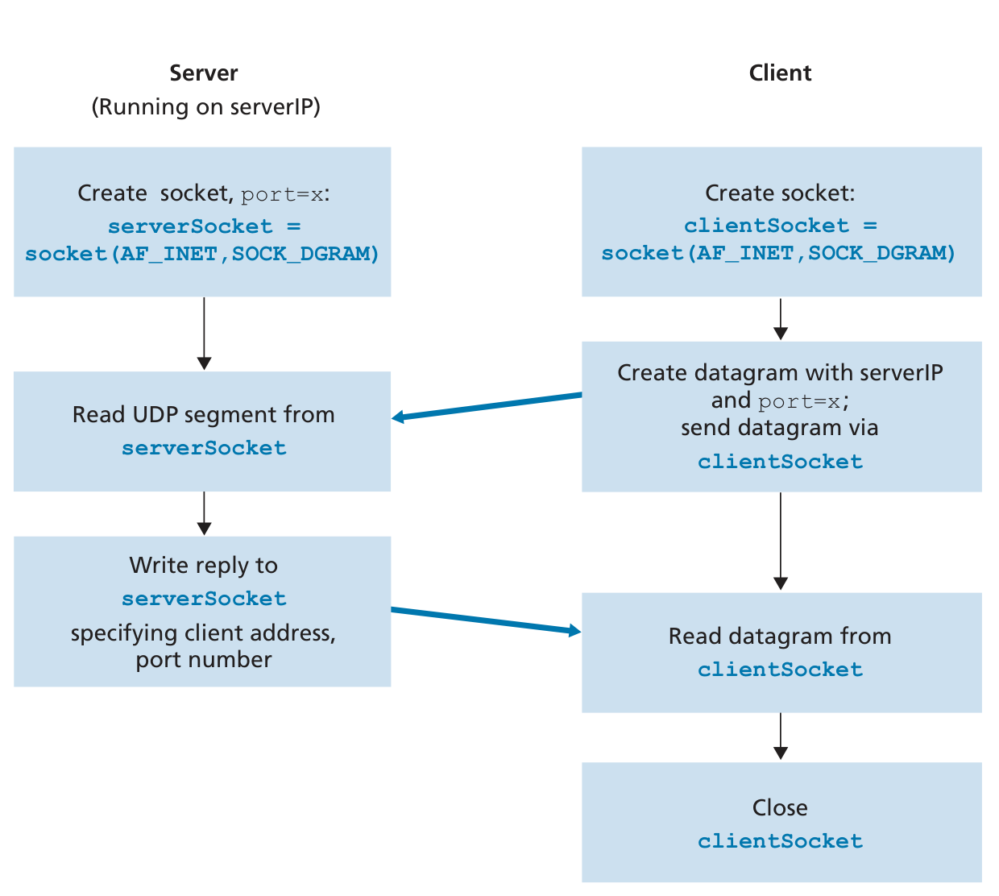

# User Datagram Protocol 
- Best effort 
- No connection establishment
- No connection state
- Small packet header overhead 
- No congestion control, blast away!

## Client Server
 

## Checksum 
The values would be in bits
 

