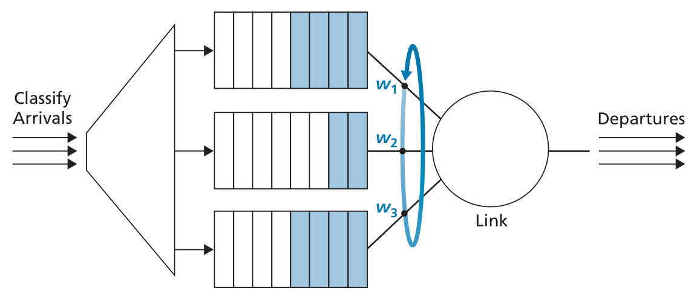

# Weighted Fair Queuing
 
- A generalized round robin approach.  
- Each class may receive a differential amount  of service in any interval of time  

To determine how much service each class gets, we assign weights and use this formula: 
$$
\frac{w_i}{\sum w_j}
$$

Where the denominator is the sum of all the classes

