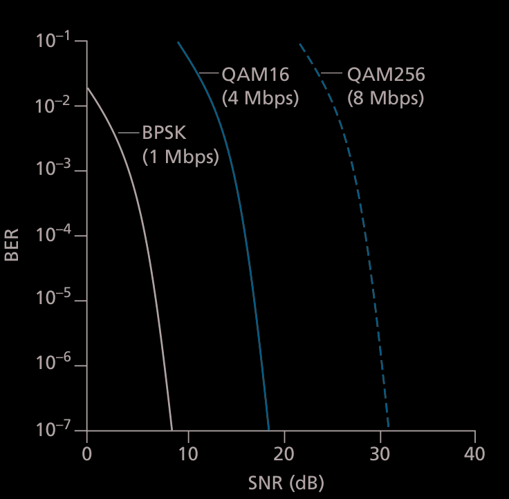
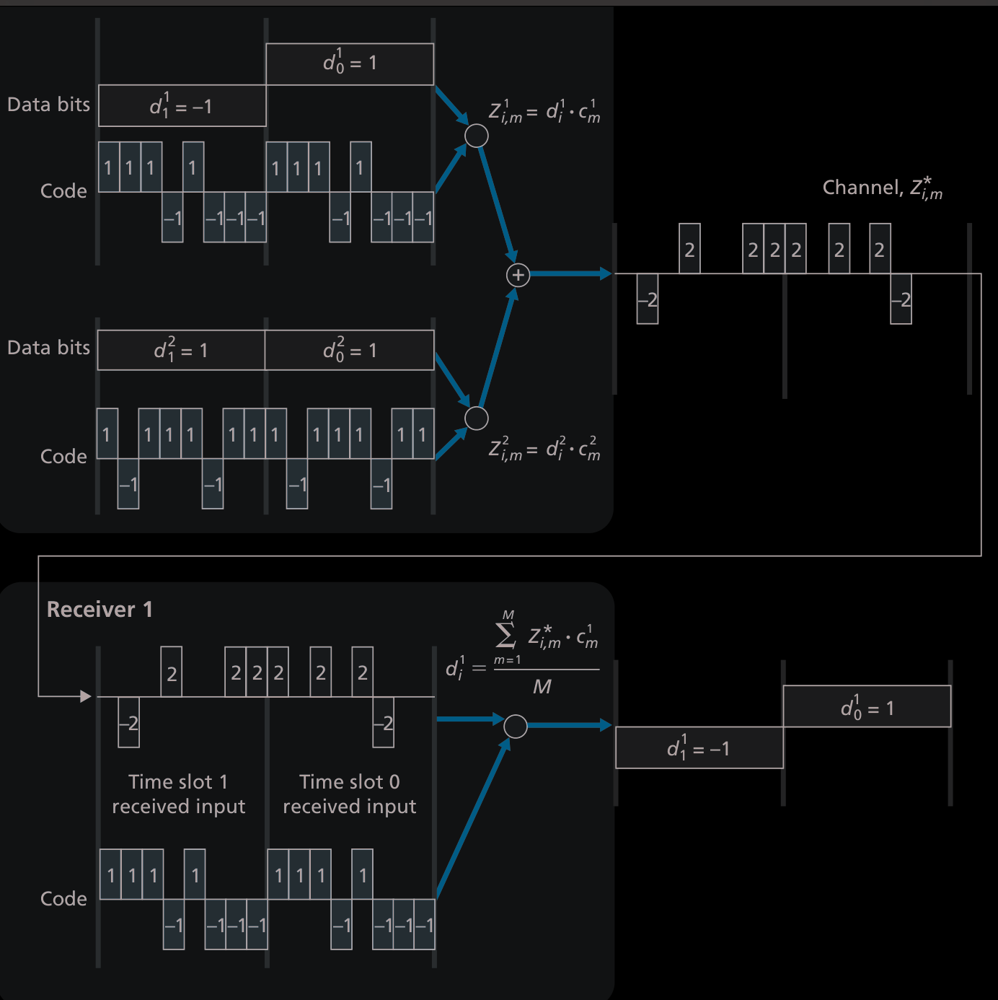
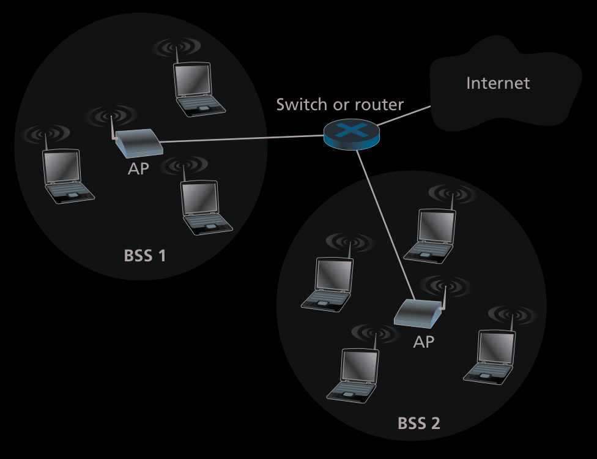
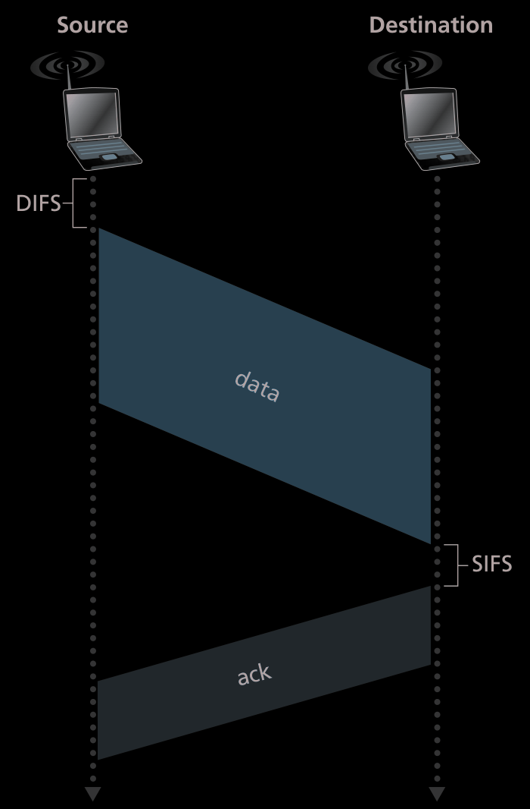
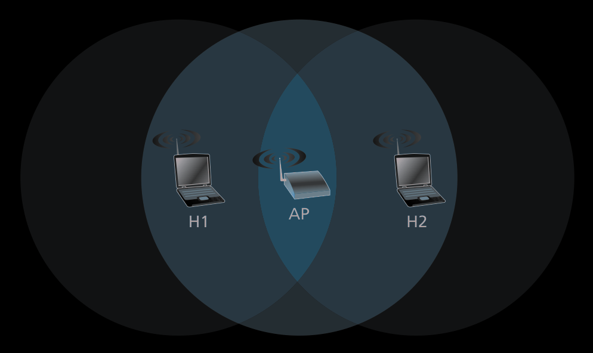
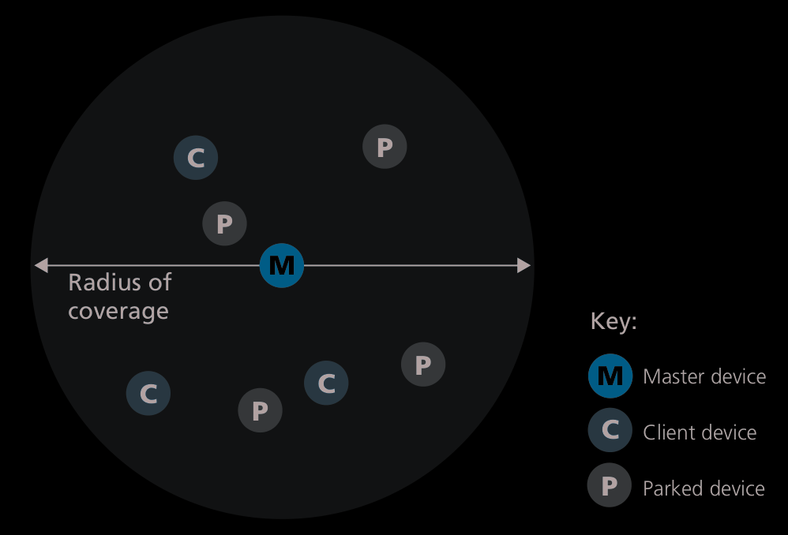

# Wireless and Mobile Networks
There are a couple of interesting things that arise when dealing with wireless networks, particularly on the host side.  
Since the access network is wireless and we are dealing with electromagnetic communications, we have to consider what happens when the host moves from one place to another.  

- Base Station: Responsible for sending and receiving packets, this is what the wireless host connects to.  
- Infrastructure Mode: host is connected to a **Base Station**.  
- Handoff/Handover: The process when a host moves from one **Base Station** to another. 
- Ad hoc network: If the host is not connected to a **Base Station**, the host must provide itself with network capable services, such as [DNS](notes/DNS.md) translation, Routing etx.. 

## Wireless Links and Network Characteristics 
Since we are dealing with electromagnetic waves, some properties must be looked at.  
- Decrease in strength as range increases 
- Interference from other sources 
- Some parts of the signal may *bounce* and lead to a blur for the receiver

### SNR 
> Signal to Noise Ratio 

We need to have a way in order to keep track of how much noise there is in our medium. 

| Image | Desc |
| -------------- | --------------- |
|  | For some reason, the decibel scale is used.  |

### CDMA
> Code division multiple access  
> This is also used in the [Link Layer](notes/Link%20Layer.md)

Using this, we can have multiple senders able to simultaneously send their messages to one receiver.  

#### How it works
[video](https://youtu.be/BkThmLtjQpE?si=WNgsS7jblWKvS161) 
> Note: For mathematical convenience we denote `0` as `-1` 

**Sender**:  
We encode each bit with a much faster rate, the **chipping rate**.  
> In the image, for the first sender on the top in the first slot, the code is going to be multiplied by the data bit `-1` 

Sum up the values for every sender.  

**Receiver**:  

| Image | Desc |
| -------------- | --------------- |
|  | The receiver can decipher the value using the code and get back the value that the sender meant to send.   |

## WiFi: 802.11 Wireless LANs

| Image | Description|
| -------------- | --------------- |
|  | An **AP** is an access point.   |

If there is no central Base or Router, and all the devices are talking together, this is known as an **ad hoc** network.  

### AP's in one area
Note that there are a limited amount of **AP's** that can be in a physical area, because the work over the frequency range of 2.4 GHz to 2.4835 GHz.  
Because of this, *channels* must be assigned in order to differentiate between the **AP's**.   
- There are $11$ possible channels 
- Any channels are non overlapping if they are separates by 4 or more channels 
- So 1, 6 and $11$ are the only **non-overlapping** channels 

### How devices connect to an AP
An **AP** has a Service Set Identifier (SSID).  
The device uses this to uniquely identify and connect to it.  

**AP's** periodically send out **beacon frames**, which includes the **SSID** and **MAC Address**.  

#### Passive Scanning and Active Scanning 
From the device side, the device *passively* listnes to these **beacon frames** in order to find **AP's**.  
When the device ***wants*** to find **AP's**, it send out **probe frame**.  
> This process is similar to **DHCP** from the [Internet Protocol](notes/Internet%20Protocol.md)  

#### Authentication 
- AP checks that the **MAC** address of the device is valid
- (Coffee shop method): Username and password 

### CSMA/CA
[video](https://youtu.be/PcbTMSf0D2M?si=B_s5sECO8UXypMcX) 
802.11 uses the same collision handling as the [Link Layers](notes/Link%20Layer.md) **CSMA** protocol, with some modifications because of the nature of the medium.  
It is known as CSMA with collision avoidance, or **CSMA/CA**.  
There is no **collision detection** 

#### How it works
| Image | Desc |
| -------------- | --------------- |
|  | The frame is transmitted in its entirety. Once the **AP** receives the frame, it uses [CRC](notes/CRC.md), waits a short while, called the ***Short Inter-frame Spacing (SIFS)***, and then sends an ACK. If the sender does not receive an ACK after a fixed number of retransmissions, it discards the frame |

#### CSMA/CA
1. Channel is idle, wait a bit of time according to the **Distributed Inter-frame Space (DIFS)**  
2. Chooses a random value to wait from the [Binary Exponential Backoff](notes/Binary%20Exponential%20Backoff.md) algorithm after this wait. If the channel is busy, **freeze** this value, else, count down.   
3. When the counter reaches zero transmit the entire frame, wait for an **ACK** 
4. **If** **ACK** is received, host knows that the frame has been received. If the host has another frame to send, go to step 2. **Else:** the frame was not acknowledged, go to step 2, **but** with a larger **backoff** value.  

### Dealing with hidden terminals 
A host can request exclusive access to the **AP** for a specified amount of time.  

| Image | Desc|
| -------------- | --------------- |
|  |This is one way to resolve the problem when two hosts are trying to talk to 1 **AP**, but they hosts dont know about each other because they are outside of each others range. |

- **RTS**: Request to send
- **CTS**: Clear to send

1. Host sends an **RTS**, receiver sends a **CTS** back. Receiver also sends a message to all other host to stop sending messages for a specified amount of time.  

> [!NOTE]
> Since this takes up channel resources, this is usually only used when the frame that is going to be sent is long. 

### 802.11 Frame

#### Multiple Addresses
There are multiple addresses, because there is an **AP** in between the host and the router, and it is part of a different subnet, these addresses are used to resolve that.  

- Address 2 is the **MAC address** of the station that sends **out** the frame.  
- Address 1 is the **MAC address** of the **receiver** 
- Address 3 is used to resolve this.  

##### An example 
Consider: `Router -> AP -> host`  
Also consider that the host already sent a datagram *upstream*, so the Router knows the **IP address** of the `host`.    

> [!NOTE]
> The `AP` is a [Link Layer](notes/Link%20Layer.md) device, and does not *speak* the [Internet Protocol](notes/Internet%20Protocol.md).  The router does not know that there is an `AP` in between it and `host`, it just thinks that the host is part of its [Subnet](notes/Subnet.md)
 
The Address 2 and address 3 are already set by the router, but the `AP` will fill in address 3 with the **MAC address** of of the Router and converting it into a **802.11** frame in the process.  

### Special Features

#### Rate adaptation 
**802.11** has a rate adaptation feature, similar to how [TCP](notes/TCP.md) congestion control works.  
If the **ACK's** are received, increase the rate, otherwise if they are lost, decrease the rate.  

#### Power Management 
Remember that **beacon frames** are constantly being sent out, we can stop this by informing the **AP** that we are going to sleep, and the frame will come back just in time when the host wakes up. The host can send a time to the **AP** and that way it will determine how long it will tell it will be asleep for. If in the meantime the host receives frames, but its asleep, the **AP** will hold the frames and buffer it.  

## Bluetooth 
Because of its short range, it is sometimes referred to as a Wireless Personal Area Network(WPAN) or a **piconet**.  
- Operate on 2.4 GHz
- Data rate reaches up to 3 Mbps
- Uses [TDM](notes/TDM.md) 

### Ad hoc network 
| Image | Desc |
| -------------- | --------------- |
|  | Because there is no **Access Point**, the system must organize itself in order to function properly. |

There is a master node that will help all the other nodes to it.  
The master nodes clock establishes the slot rate for all the nodes.  

### How the network is formed 
1. Neighbor discovery 
> What other devices are in the network? 

Do this by sending out 32 inquiry messages each with a different frequency, 128 times.  Client responds and the master knows who is there.  

2. Bluetooth Paging
Sync up all the clients that have been found 

## 4G and 5G
[video](https://youtu.be/2sJOEJxCbi0?si=rJneJTz4Rx6W1bK6) 
> A lot of the infrastructure here is analogous and sometimes even symmetrical to how [Computer Networking](notes/Computer%20Networking.md) works as a whole.  

Cellular network refers to the *cells* that a provider has in an area.  

- Mobile device:  
  - Is a network endpoint, with an **IP Address**(obtained through a [NAT](notes/NAT.md))
  - International Mobile  Subscriber Identity (**IMSI**): 64 bit unique identifier, similar to [MAC Address](notes/MAC%20Address.md) 
- Base Station 
  - Provide allocation of resources and authentication to **Mobile Devices** 
  - Coordinates with other **Base Stations** in order to minimize connection interference. 

- Home Subscriber Network(HSS): 
  - A database used by the ISP in order to track the people that are subscribed to the network. It uses your unique **IMSI** in order to track you.  

- Serving Gateway (S-GW), Packet Data Network Gateway (P-GW):
  - Provides [NAT](notes/NAT.md) like functions, it uses this because there are so many mobile devices, that it cant possibly have unique IP addresses for each device
  - Forward **IP Datagrams** among themselves in the network.  

- Mobility Management Entity (MME):
  - Manages real time state of devices connection 
  - Authnetication 
  - Device handover

### Associating with a base station 

Similar to how 802.11 connects to a device, but its a bit more complicated because you might be connecitn to a network that is not your provider, need for authentication etx.  

### Sleep Mode
Similar to 802.11, there is a sleep mode

## Mobility with IP

IP can already handle moving from one network to another, but there is a problem 

Better way is to use a central "home" to link to 
Triangle flow 
another way: direct routing of traffic 
some appliations might break 

Handover in same network 
source request -> target BS
MME? 

The whole point of this is to let applications like [TCP](notes/TCP.md) to maintain connections, but in the process of doing this we might lose some packets, and [Congestion Control](notes/Congestion%20Control.md) can happen

